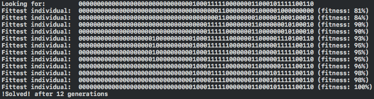

footer: "Rubik's Cubes and Genetic Algorithms In Swift" - @Javi
slidenumbers: true
autoscale: true
theme: Fira, 5

# *Rubik's Cubes*
# [fit] and *Genetic Algorithms*
## in Swift

### *@Javi*

^ -  Welcome!
- My name is Javi, I'm an iOS Engineer, previously on the Twitter for iOS team, and Fabric before that.
- Today I'm going to talk about a fun little side project I worked on over a weekend: a small Rubik's Cube library in Swift, and a genetic solver algorithm.
- I'm by no means an expert in genetic algorithms, but this was incredibly fun and pretty fascinating, so I would love to share that with you today.

----

# [fit] *Evolution* by Natural Selection


^ - First, let's get an overview of where this comes from.
- The theory of Evolution by Natural Selection was put forward by Charles Darwin in 1859 in the book "On the Origin of Species".
- This theory is able to explain how a very simple process, natural selection, is able to create organisms with such complexity like us.

----

# [fit] *Evolution* by Natural Selection

 

^ - Through random mutations that occur as organisms reproduce, the idea of the "survival of the fittest", and a few billion years, we got from single cell organisms like the one on the left, to incredibly complex structures like our eyes.

----

# [fit] *Evolution* by Natural Selection

1. ?
2. *Random mutations* in genome
3. Survival of the *fittest*
4. (**Rinse and repeat**)

^ - I don't have time to give a full biology class here, but these are the basic steps that this process takes:
- We don't know how life started, but once we had the chemical ingredients for life, all evolution needed was time.
- Random mutations that occur essentially as errors during the duplication of DNA material when organisms reproduce create variety and change in the genome.
- With time, some of those mutations will prove advantageous to some organisms, and will allow them to survive at a higher rate. And so they will be able to pass on those mutations to further generations.

----

# [fit] *Genetic* Algorithms

^ - So why are genetic algorithms so useful in computer science?
- A lot of the problems we solve with programming can be solved using some combination of mathematics, divide and conquer.
- However, there are some problems for which it's very hard to come up with a clear set of steps to solve it, or to write them in code.
- There are many relatively simple methods to solve a rubik's cube. I could've written a program to follow the same logic and steps in one of those methods, but that would be no fun.
- Instead, with a genetic algorithm, we can come up with an algorithm to solve a Rubik's cube without having to encode any sort of rules for how to solve a cube.

-----

## [fit] *Genetic* Algorithms

 
 

^ - This is an example of the coolest thing I've seen people do with genetic algorithms.
- By using triangles with random position, size, and color, this program is able to approximate to a picture of the Mona Lisa painting.
- The results are incredibly accurate.
- The last slide has a link to the full article with more details about this.

-----

# [fit] *Genetic* Algorithms - Example

### 1. *Goal*: find a number *'x'*
### 2. *Start* with *0000000000000000*
### 3. *Mutate* each randomly, *bit by bit*
### 4. Calc *fitness* comparing with *x*'s bits

^ - Before getting into the Swift code for the Rubik's cube solver, let's look at a much simpler problem solved with a genetic algorithm, to get an idea of what they look like.
- We're going to implement one that, given a number we'll give it, will try to find that number. Now, of course a genetic algorithm is overkill for this problem, but I picked it because it illustrates the very simple steps a genetic algorithm needs to take to function.
- Don't worry if you can't follow along with the code in the slides, I will go fairly quick. There's a playground with this code along with the slides in my Github repo.

-----

# *Genetic* Algorithms - Example

```swift
final class Individual {
    let number: UInt

    init(number: UInt) {
        self.number = number
    }
}
```

^ - Our genetic algorithm is going to work with a pool of individuals.
- Each of these individuals in our population is going to represent a number, this is a potential solution to our problem of finding the number we're looking for.

----

# *Genetic* Algorithms - Example

```swift
typealias Fitness = Int

extension Individual {
    func fitness(withGoal goal: UInt) -> Fitness {
        return Fitness(self.number.numberOfBitsEqual(in: goal))
    }
}
```

^ - This right here is perhaps the most important part we need to be able to implement a genetic algorithm. We need to have a way to calculate the fitness of each individual, to determine which ones are the fittest.
- You can think of this value as how close this individual is to what we're looking for. In this case it's how close it is to the number we're trying to find, in the case of the Rubik's cube, how close we are to a solved cube.

----

# *Genetic* Algorithms - Example

```swift
extension Individual {
    let likelihoodOfMutatingBit = 5

    func mutate() -> Individual {
        let mutatedBits = self.number.bits.map { bit -> Bool in
            let shouldMutate = Bool.random(percentage: likelihoodOfMutatingBit)

            return shouldMutate ? !bit : bit
        }

        return Individual(number: UInt(bits: mutatedBits))
    }
}
```

^ - I'm not showing some simple helper functions to convert numbers to a bit representation and backwards, but we rely on them to "flip" some of the bits, in this case 5% of the time.
- Here's the thing about random mutations, whether it's in our algorithm, or in the real world. These mutations are not guaranteed to take us anywhere closer to the solution, or to an organism more likely to survive. In fact, most mutations are either negative, or have no effect.

----

# *Genetic* Algorithms - Example

```swift
final class GeneticSolver {
    var population: [Individual]

    init(numberToSolve: UInt, populationSize: Int)

    func runGeneration() {
        // 1: Natural selection (survival of the fittest)
        population.removeLast(Int(Double(population.count) * 0.8))

        // 2: Random mutations
        population += population.map { $0.mutate() }

        // 3: Sort by fitness
        population.sort { $0.fitness(towards: numberToSolve) > $1.fitness(towards: numberToSolve) }
    }
}
```

^ - Now we can put it all together. This is how simple the algorithm is. The steps we talked about before.
- The least fit individuals are less likely to survive, so they go away.
- The rest mutate randomly, potentially getting us closer to the solution.
- And then we sort all of them by fitness, putting the fittest in the front.

----

# *Genetic* Algorithms - Example



^ - In this sample run with a population size of 10k, we found the solution after 12 generations.
- We can tweak the parameters, like the population size, or the rate of mutations, and we'll get different results. It's actually a lot of fun to play with it and see what different behaviors we get.

----

# *Rubik's* Cubes


^ - Now that we know the basics about genetic algorithms, let's move onto a cooler problem: Rubik's cubes.
- I'm sure you've all heard about this old puzzle, but here's some random trivia you might not know.
- The Rubik's cube was invented in 1974.
- Over 350 million Rubik's Cubes have been sold world-wide.

-----

# *Rubik's* Cubes


^ - This is my personal collection.

----

# *Rubik's* Cubes


^ - This is what a cube looks like inside. The center pieces don't move, because they're fixed to 6 axis around which the faces rotate.
- There are 2 types of pieces: edges and corners. Edges have 2 stickers on them, corners have 3.

----

# *Rubik's* Cubes

### [fit] 43,252,003,274,489,856,000

^ - Despite its apparent simplicity, it has 43 quintillion possible arrangements. And only one of them is the solved position!
- If you could try each and every one of these, one per second, it would take you 100 times the age of the universe to reach all of them.
- This is a fun fact, but the reason why it's important to us is because it shows that even at a much higher rate than 1 position per second, a brute-force algorithm would take too long to solve a cube.

----

# *Rubik's* Cubes


^ - Some people can solve them ridiculously fast.

----

# `RubikSwift`

```swift
struct Cube {
    struct Pieces {
        var edges: EdgePieceCollection
        var corners: CornerPieceCollection
    }

    var pieces: Pieces
}
```

^ - Before we can implement the genetic algorithm, we're going to need a way to represent a Rubik's cube in code.
- Like we saw before, there are 2 types of pieces, that we represent separately because we will manipulate differently.

-----

# `RubikSwift`

```swift
enum EdgeLocation {
    case topRight, topFront, topLeft, topBack...
}

struct EdgePiece {
    enum Orientation {
        case correct
        case flipped
    }

    var location: EdgeLocation
    var orientation: Orientation
}
```

^ - These are edges. All pieces are characterized by both their current position in the cube, but also their orientation. Edges have 2 orientations: the correct one, but also a flipped one.

----

# `RubikSwift`


^ - This is an almost solved cube with 2 flipped edges.

-----

# `RubikSwift`

```swift
struct CornerPiece {
    enum Orientation {
        case correct
        case rotatedClockwise
        case rotatedCounterClockwise
    }

    var location: CornerLocation
    var orientation: Orientation
}
```

^ - Same for corners. In this case, because a corner faces 3 sides of the cube, they have 3 possible orientations.

-----

# `RubikSwift`

```swift
struct Cube {
    struct Pieces {
        var edges: EdgePieceCollection
        var corners: CornerPieceCollection
    }

    var pieces: Pieces
}
```

^ - With this we can assemble a cube where all pieces are in their correct place and orientation, aka the solved cube.
- From here, the next step is going to be having an API that allows us to manipulate the cube in the same way we would with our hands: moving each of the faces, and tracking what happens to the piece location and orientation.

----

# `RubikSwift`

```swift
enum Face {
    case top, bottom, left, right, front, back
}

struct Move {
    enum Magnitude {
        case clockwiseQuarterTurn
        case halfTurn
        case counterClockwiseQuarterTurn
    }

    let face: Face
    let magnitude: Magnitude
}
```

^ - Everything we can do on a cube is move one of its faces, either clockwise, or counterclockwise, or a half-turn.

----

# `RubikSwift`

  

^ - Here are 3 examples of that, where we've moved the top face clockwise, counterclockwise, and half a turn respectively. Half-turn is equivalent to 2 quarter turns in either direction.

----

# `RubikSwift`

```swift
extension Cube {
    mutating func apply(_ move: Move)
}
```

^ - Lastly, we need to implement a function to apply a move.
- I'm not going to show the implementation of this because it's the trickiest part of all, and it would take quite a few slides.
- But this whole code is OSS, so you can take a look at it in more detail on GitHub.

----

# `RubikSwift`

```swift
final class Individual {
    let moves: [Move]

    init(moves: [Move]) {
        self.moves = moves
    }
}
```

^ - These are going to be out individuals in our pool.
- Our algorithm is going to start with a random state of a Rubik's cube, and try to solve it.
- Each of the individuals is going to have a sequence of moves that they will apply on top of that cube state to attempt to solve it.

-----

# `RubikSwift`

```swift
typealias Fitness = Int

extension Individual {
    func fitness(solvingCube cube: Cube) -> Fitness {
        var cubeAfterApplyingMoves = cube
        cubeAfterApplyingMoves.apply(self.moves)

        return cubeAfterApplyingMoves.numberOfSolvedPieces
    }
}

extension Cube {
    // Number of pieces in the correct location and orientation
    var numberOfSolvedPieces: Int
}
```

^ - Their fitness is going to be determined by how many pieces applying their moves is able to place in the correct location with the correct orientation.
- An individual with higher fitness is closer to solving the cube than one with a lower fitness.
- This is the beauty of the genetic algorithm: we just need a way to determine how we close we are to the solution, and in this case it's trivial, but we don't need to tell the program what the steps towards that solution are!

----

# `RubikSwift`

```swift
extension Individual {
    func mutate() -> Individual {
        var moves = self.moves

        let randomMoves = Move.randomMoves(count: Int.random(in: 5...20))

        moves += randomMoves

        return Individual(moves: moves)
    }
}

```

^ - Mutating can be done in different ways, there's really not one answer.
- In this slide I show a basic approach we can take: we just create random moves, and we append them to the solution, with the hopes that sometimes those moves will take us closer to the solved state.
- In my actual implementation I tried a slightly more sophisticated approach than this after some trial-and-error.

----

# `RubikSwift`

```swift
final class Solver {
    private(set) var population: [Individual]

    init(scrambledCube: Cube, populationSize: Int)

    func runGeneration() {
        population.removeLast(Int(Double(population.count) * 0.8))

        population += population.map { $0.mutate() }

        population.sort {
             $0.fitness(solvingCube: scrambledCube) >
             $1.fitness(solvingCube: scrambledCube)
         }
    }
}
```

^ - And the solver becomes, once again, trivial. We remove the worse solutions, mutate the ones that we have, and sort by which ones are closer to the solution.

----

# `RubikSwift`

## Does it *actually* work?

^ - So now the question is: how well does this *actually* work?
- Well, unfortunately I haven't gotten it to solve an entire cube, but it got impresively close!

----

# `RubikSwift`

```
Cube: R' F' B D2 L' R' D2 R' F2 B2 D F L' R2 F' U2 R' U' D F

1: New best: B2 (3.0)
3: New best: B2 U D' U2 F2 D2 B U2 D R B' [...] (6)
7: New best: B2 L2 U2 L' B2 F' U' U' D L2 [...] (7)
100 (avg fitness 3.6012, 23806 algs/sec, 0 min elapsed)
3465: New best: B2 D2 U R2 B2 U2 B' F2 D [...] (13)
10000 (avg fitness 6.462, 11217 algs/sec, 74 min elapsed)
25781: New best: L' D' B2 L2 B' D R2 F R' [...] (**16**)
80800 (avg fitness 9.2612, 7676 algs/sec, 877 min elapsed)
```

^ - This is a summarized output of one of the runs where I left my computer running for almost 15 hours.
- The letters represent the syntax we use to represent moves. The letter indicates the face (Up, Down, Left, Right, Front, Back), and what's next to it indicates the direction and magnitude of the turn.
- The first line is the random sequence of moves that it used to scramble the cube to a position that then it tried to solve.
- The last line is after 80k generations, it tried close to 500 MILLION different sequences of moves.
- The solutions are abbreviated for the slide, the best one was actually 220 moves, which is not efficient at all.
- The second to last line shows the best fitness it arrived at: 16.
- A cube has 12 edges and 8 corners, so 20 pieces. That means that it was just 4 pieces shy of solving the cube.

----

# `RubikSwift`


*Fitness: 16*

^ - This is what the cube looked like after that solution of fitness 16. It's SO close!
- In fact, all the pieces where in their correct location, 4 of them were just in a rotated orientation.
- And this was done by a program written without any rules for how a cube should be solved. This program created complexity out of very simple steps.

----

# *Links*

*-* [http://github.com/JaviSoto/talks](http://github.com/JaviSoto/talks)
*-* [http://github.com/JaviSoto/RubikSwift](http://github.com/JaviSoto/RubikSwift)
*-* [https://rogeralsing.com/2008/12/07/genetic-programming-evolution-of-mona-lisa/](https://rogeralsing.com/2008/12/07/genetic-programming-evolution-of-mona-lisa/)

# *@Javi*

^ - These are some useful links.
- My Twitter account is @Javi, I'll tweet a link to this presentation where you can click on these and see the full source I talked about today.

----

# **Thank you** 😊
