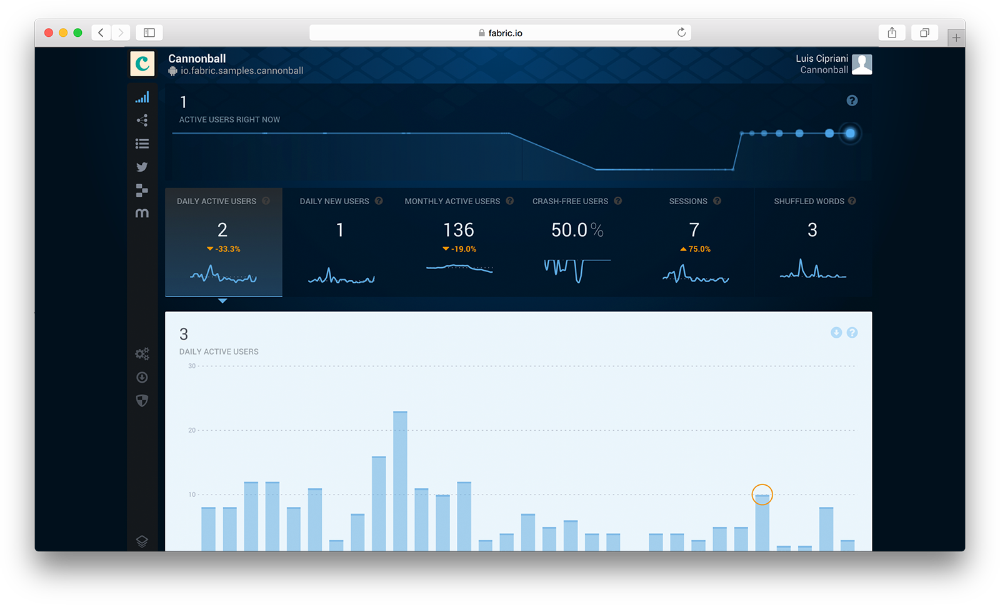
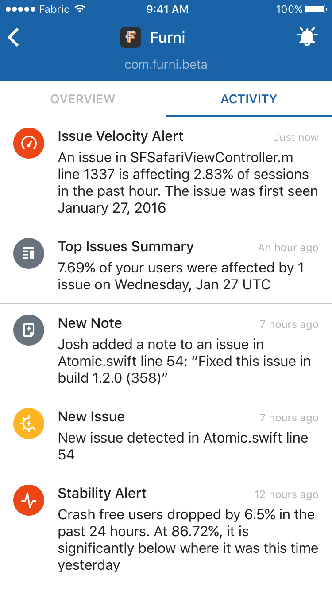
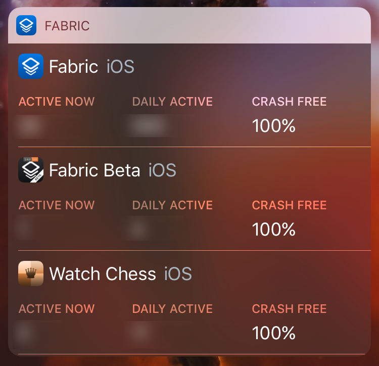
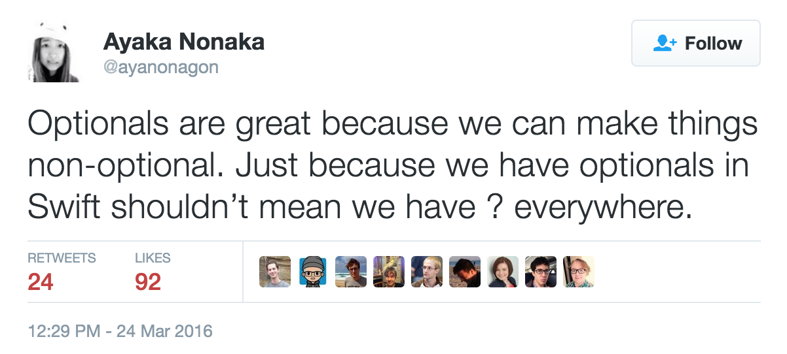
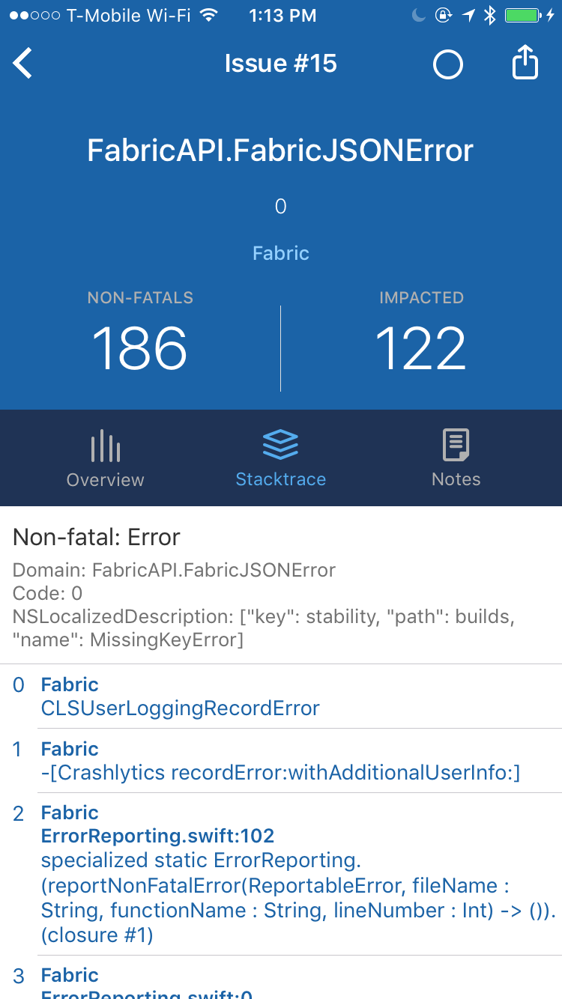
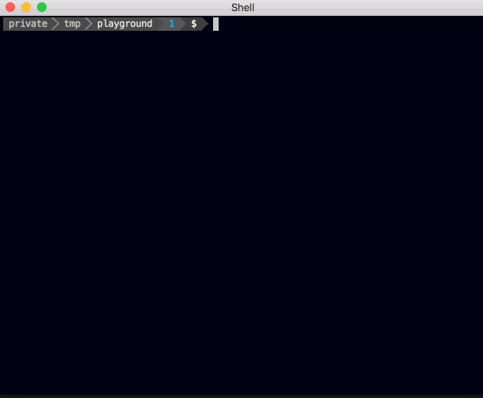

footer: "Building the Fabric iOS App" - @Javi. NSSpain 2016
slidenumbers: true
autoscale: true
theme: Fira, 2

# Building the Fabric iOS App

  

# @Javi

^ - Welcome! My name is Javi, I'm an iOS engineer in the Fabric team at Twitter in SF. Since a year ago I've been working on the Fabric app for iOS which came out this last January.
- Previously I worked at Pebble and built a chess app for watchOS.
- You can follow me on Twitter where I talk about programming, but mostly about other stuff.
- I want to thank the organization of NSSpain for inviting me here, to my home country, to speak about my work. It's actually the first time ever that I speak at a conference in Spain. It makes me really happy that one of the most well respected Apple dev conferences in the world happens in Spain, so congrats to the team who works on it!

----

# Outline

- Fabric
- GraphQL
- Dependency Injection
- Error Reporting
- Fastlane

^ - So when I was preparing this talk, I went through the codebase of the Fabric app looking for interesting things that I could share.
- There were snippets of code here and there that could be interesting, but I realized that many talks would have a lot of code in their slides already, so perhaps that wouldn't be the most valuable thing for me to share with you today.
- While I will go over a couple of code examples from the app, instead, I want to cover some of the technical decisions we made during the development in the hopes that some of that will be useful to some of you, perhaps in the app that you're working on now, or whatever you work on next.

----

### What's Fabric?

^ - But before I get started, let me give a brief insight into to what Fabric is for those of you who might not be familiar with it

----

# Fabric



^ - How many of you use Fabric or have used it before?
- Fabric is a set of different tools to help you build apps. The most recognizable of those is perhaps Crashlytics.
- But my favorite aspect of Fabric is how Crashlytics plays with Answers, the analytics pipeline of Fabric, to deliver much more useful metrics and information about how your app is performing in the real world.
- What you see in this screenshot is the main Fabric dashboard: a realtime view into the most important metrics of your app.

----

# Fabric

  

^ - So when we set out to build the Fabric app, we wanted to bring the best of Fabric to mobile.
- Now no matter where you are, you can peek into your app stability, how your last release is doing, and with the latest release that just came out earlier this week, all the custom analytics that you're tracking using Answers Events.
- But if I have to pick my favorite feature of the app, as an iOS dev, it would be the ability to receive push notifications if something really really bad is happening with the stability of the app.
- Now, this may sound like a nightmare if you're on vacation for example. But what's interesting about knowing that the app will send you push notifications in that case, is that, because thankfully this very rarely happens, the fact that you're getting **no** notifications from the app is a great reminder that your app is doing well!
- So I should rephrase: my favorite feature of the app is **not** getting notifications and knowing that Fabric has my back if anything happens. I really recommend it.

----

## GraphQL[^1] 

[^1]: http://graphql.org/

^ - So that's it for my sales pitch, I promise.
- Now let's start by talking about GraphQL. This is one of the technologies that we adopted most recently in the app, and which I'm really excited about.
- GraphQL was announced and OSSed only a year ago by Facebook, but they've been using it since 2012. And while most of the tooling around it so far has been built for the web, I think it has a ton of potential for mobile.
- The GraphQL.org website has a good introduction to what GraphQL is and some examples.
- It describes GraphQL as a "data query language". What does this mean?
- GraphQL defines a specification for a language to use to write queries against a graphQL server. These queries allow a client, say, a mobile application, to specify which entities and fields it wants to request.
- Now, before showing you what's cool about it and a couple of examples where we use it in the app, let's look at an example of a traditional REST API.

----

# GraphQL - Queries

- `GET /users/<user_id>`

^ - Imagine that we wanted our app to request the information about a user. In a traditional REST API world, we would construct something like the following API endpoint.
- Now, when this endpoint is designed, we must make the decision as to which fields we want to return. This depends heavily upon the client that is going to be using it.
- Some time later, perhaps, another client starts using your REST API, which now wants to request more data. For example, the list of friends of this user. But you don't want to add too much data to that response, because that will increase the payload size for the first client which doesn't need that, which in mobile, has consequences on latency, data usage, battery, etc.

----

# GraphQL - Queries

- `GET /users/<user_id>`
- `GET /users/<user_id>/friends`

^ - So you add a new endpoint.
- Now the second client must make 2 network requests. This is not the end of the world in many cases, but I'm sure many of you have experienced cases where going down this path, things get complicated, and either your REST endpoints end up returning way too much data, or your app is making a lot of requests to compose one single screen.
- And this is in simplified terms the core problem that GraphQL tackles.

----

# GraphQL - Queries



^ - Let's take look at a real-world example. This is Fabric's NC widget we launched earlier this year.
- When we were designing it, we could've built a custom, ad-hoc endpoint for it, which given a list of app IDs, would've returned the info that we wanted. However, creating a new endpoint for every single piece of functionality your clients want can result in an explosive growth of the number of endpoints, which is terrible for the people working maintaining the API services.
- The straw-man solution to this problem, of course, would be to make a request to each of the services that provide all that data: for currently active users, daily active users, and crash free users. Those responses would've come back with a ton of data, even though we only wanted the one number we're displaying. But more importantly, doing so would've required 3 times 3, **9** network requests to load the notification center widget. This would've been terrible for performance, battery and data usage.
- So instead of all of that, we took advantage of the GraphQL infrastructure that had been set up earlier in the year to power some of the new functionality in the Fabric website.

----

# GraphQL - Queries

```
{
  user(id: 4802170) {
    name
    profilePicture(size: 50)  {
      uri
      width
    }
    friends(first: 5) {
      id
      name
    }
  }
}
```

^ - Going back to the user API, this is an example graphQL query of how our client could request a specific user, parametrized by the ID, and some fields, including nested fields like the list of friends.

---

# GraphQL - Queries

```json
{
  "data": {
    "user": {
      "id": "4802170",
      "name": "Javi",
      "profilePicture": {
        "uri": "http://bit.ly/1E8lYDq",
        "width": 50
      },
      "friends": [
        {
          "id": "305249",
          "name": "Jony Ive"
        },
        {
          "id": "3108935",
          "name": "Elon Musk"
        }
      ]
    }
  }
}
```

^ - And this is what the response we would get would look like. It's just a human-readable JSON following the structure in the query that we requested.
- Similar perhaps to the response format that we could've designed when making a custom API endpoint, but without having to actually create one.

----

# GraphQL - Features

- Hierarchical, human-readable query language
- Strongly-typed
- Version free

^ - These are some of the features that GraphQL highlights.
- It's strongly-typed because each of the objects returned under one of the fields in a query is of a well-defined type. Types can be primitives like strings or integers, but also own-defined types similar to structs and enums in Swift. They also allow to mark fields as optional or required.
- Version-free means that the format of the responses is entirely dependent on the query, which we can change in different app releases, and therefore don't have to worry about backwards compatibility (as long as the graphQL schema in your server doesn't change in backwards-braking ways). As an example, Facebook says that they still support 3-year-old Facebook apps on a single version of their GraphQL API.

----

# GraphQL - GraphiQL


^ - This is GraphiQL: an interactive console to test out queries against your GraphQL server. We have one of those running at Fabric, and it's immensely valuable when prototyping, debugging or building a new feature. When you type in the query panel, it supports auto-completion so you can discover which fields are available without having to look at documentation or the implementation of your API or anything like that.

----

## [fit] Dependency Injection

^ - Next, I want to talk about something a little bit more subtle, but which is one of the most important rules that we follow everywhere across the codebase of the Fabric app, and I've come to realize it's a very standard practice.
- I will explain why I think it's very important, and how it enables us to get certain guarantees of correctness in the app, which helps us ship faster and with more confidence.
- So what is dependency injection? You may have heard this term thrown out many times. It sounds very fancy, but it doesn't need anything advanced to be implemented.
- It's important to first realize that, to do dependency injection, we don't need to use any 3rd party library!

---

# Dependency injection

> Software design pattern that implements inversion of control for resolving dependencies. An injection is the passing of a dependency to a dependent object that would use it.
-- https://en.wikipedia.org/wiki/Dependency_injection

^ - This is the definition in Wikipedia
- (*read*)
- It doesn't help with the notion that dependency injection is seen as a very esoteric concept.
- First of all, what is a dependency? It's really just any object that a class needs to do its job.

----

# Dependencies

- View Controller => Data Provider
- Data Provider => API Client
- Persistence Manager => Database Client

^ - These are some examples of dependencies. A view controller needs some kind of data provider.
- This data provider may need the API client.
- Some persistence object may need a way to query the database, etc.

---

# Dependency Resolution

- Self-instantiation
- Global access
- Injection via setters
- Injection via constructor

^ - For those types that we just mentioned to have access to their dependencies, that can happen in 4 ways. Let's look at them in practice.

---

# [fit] **Dependency Resolution** - Self-Instantiation

```swift
class ViewController {
	private let dataProvider: DataProvider

	init() {
		self.dataProvider = DataProvider()
	}
}
```

^ - The first is Self-instantiation. Where the type just creates the dependencies it needs by instantiating them directly.
- **Pros:**
- Easy to write
- Easy to instantiate objects that have dependencies
- Compatible with storyboards and segues
- **Cons:**
- Can't tell dependencies of a type without looking at code
- Can't stub-out dependencies
- Can't configure in different ways

----

# [fit] **Dependency Resolution** - Global Access

```swift
class ViewController {
	private let dataProvider: DataProvider

	init() {
		self.dataProvider = DataProvider.shared
	}
}
```

^ - Second is global access, where the type reaches out to some global accessor or singleton to retrieve its dependencies.
- **Pros:**
- *(Same as before)*: easy
- **Cons:**
- *(Same as before)*: can't tell dependencies, can't customize
- Singletons: it becomes hard to reason about how the difference pieces of your app are interacting with oneanother.

---

# [fit] **Dependency Resolution** - Injection via Setters

```swift
class ViewController {
	var dataProvider: DataProvider!

	init() {

	}
}
```

^ - 3rd is the first type of injection, through the use of setters.
- **Pros:**
- We can now stub-out or mock dependencies or configure in different ways, which helps with code reuse
- Decoupling type from its dependencies and how those are constructed
- Compatible with storyboard segues
- **Cons:**
- More cumbersome to construct objects
- Can't tell dependencies of a type by looking at constructor
- Not compile-type safe: can crash at runtime
- Dependencies can change after construction: trickier to get implementation of this type right in all the invariants

---

# [fit] **Dependency Resolution** - Injection via Constructor

```swift
class ViewController {
	private let dataProvider: DataProvider

	init(dataProvider: DataProvider) {
		self.dataProvider = dataProvider
	}
}
```

^ - And lastly we have my favorite: injection via the type constructor.
- **Pros:**
- Same as before: flexibility of using different impls of the dependencies.
- Dependencies are explicit by looking looking at constructor.
- Compile-time guarantee: types must be well constructed
- Dependency is not a constant.
- **Cons:**
- Also more cumbersome.
- Tricky to do with storyboards. I'll go back to that after.

----

## **Easy** vs **Simple**

^ - I'm sure many of you have already heard about these 2 in many other technical talks so I won't spend a lot of time with this philosophical debate here, but I did want to drive attention to this again because I think this distinction comes into play here when looking at the different ways we have of resolving dependencies, as with many other things in programming.
- These 2 may appear to be synonyms at first, but they're not quite exactly the same. The easiest way for me to remind myself that they imply different things is to look at their opposites.

----

## **Easy** - Hard
## **Simple** - Complex

^ - And so because of this I think we're so often driven to pick what's easy, without realizing it may in fact increase the resulting complexity.

---

## [fit] Dependency injection
## **Implicit** vs **explicit**

^ - Now, you could say: "dependency injection has made my code more complex, look at this constructor with so many parameters now!"
- But here's what's important to realize about that: if you class has a lot of dependencies, your class is, by definition, complex. Dependency injection only makes that **explicit**. And I think this distinction between explicit and implicit is one of the most important ones when writing maintainable code, and it's one of the reasons why I find dependency injection via constructors so important.

----

# [fit] Dependency injection - UIStoryboard

```swift
class UIStoryboard {
	func instantiateViewController(withIdentifier identifier: String) -> UIViewController
}
```

^ - Now let's look at some real world iOS examples of dependency injection. First, I wanna draw our attention to storyboards.
- This is the API that we have available to instantiate view controllers from a storyboard. By instantiating a controller through `UIStoryboard`, we're not able to use the actual constructors from our controller, which means we can't do proper dependency injection! We can call the setters on the controller after using this, but that has a few problems.

---

# [fit] Dependency injection - UIStoryboard

```swift
let sb = UIStoryboard...
let vc = sb.instantiateViewController(withIdentifier: "ID") as! ApplicationOverviewVC
vc.userSession = ...
vc.applicationID = ...
```

^ - This is how we would instantiate the view controller. Besides the fact that we have to look at the source of the controller to know which properties we must set, let's look at what other issues exist within the implementation of the controller when doing this.

---

# [fit] Dependency injection - UIStoryboard

```swift
final class ApplicationOverviewVC {
	// I hope you like "!"s...
	var userSession: UserSession!
	var applicationID: String!

	func viewDidLoad() {
		super.viewDidLoad()

		self.userSession.foo()
		// Or...
		if let userSession = self.userSession {
			userSession.foo()
		} else { /* Can't do anything useful here... */ }
	}
}
```

^ - Since we have no guarantee that all the required parameters will be set at runtime, we have to decide what to do at runtime if one of them is missing.
- When we first use that `userSession` dependency, we can make the choice between crashing, or leave the app broken, because we don't really have anything useful to do in that else case.
- The first version of the Fabric app actually shipped in the AppStore using storyboards and a clever but ugly hack that had to be written in Objective-C and not in Swift, which tells you how bad of a hack it was. If you're curious, I made the code available in gist.
- I've read many complaints about how noisy Swift is because of optionals and implicitly unwrapped optionals. This is totally true. My antidote for that is to always design my code so that I can use as few of them as possible!

----



^ - This was very well captured in this tweet by Ayaka: "Optionals are great because we can make things non-optional"!

----

# [fit] Dependency injection in the Fabric app

```swift
final class ApplicationListViewController: UIViewController {
	init(viewModel: ApplicationListViewModel)
}

final class ApplicationListViewModel {
	init(fabricAPI: AuthenticatedFabricAPI)
}

public final class AuthenticatedFabricAPI {
	public init(session: Session)
}

public struct Session {
	let accessToken: String
}
```

^ - Alright, let's go back to the Fabric app to see some more concrete benefits of deploying dependency injection.
- In this code, the view controller needs a view model (which will be in charge of making the network requests).
- The view model has to be instantiated with a non-null `AuthenticatedFabricAPI`.
- `AuthenticatedFabricAPI` can't be instantiated without a `Session` struct, which itself, needs an access token.
- Note the lack of `Optional` question marks everywhere.
- So what this means is that we can prove at compile time that this view controller, which shows user data, cannot be presented in the screen without first acquiring a user session, and an access token to make authenticated requests. Isn't that great?

----

# `DataLoadState`

```swift
final class ApplicationListViewModel {
	var applications: [Application]?
}
```

^ - Moving on from dependency injection, this is another example of how we managed to use fewer optionals.
- Imagine a few model that encapsulates the data that a view controller displays. In this case, it's the list of applications in the Fabric app. Now, we represent that as an `Optional` because we may not always have data. Now, if that optional is `nil`, does that mean that the data is currently loading, or it has failed to load? This may not matter depending on what the UI looks like, but if we want to display something different in the UI in case the request failed, we may want to be able to distinguish these 2 cases. Because we kept having subtle UI bugs due to this, I decided to model this explicitly.

---

# `DataLoadState`

```swift
enum DataLoadState<T> {
    case loading
    case failed
    case loaded(T)
}

final class ApplicationListViewModel {
	var applications: DataLoadState<[Application]> = .loading
}
```

^ - Now, with this enum, we can explicitly consider each of those cases separately, without having to make guesses, and without the use of optionals.

----

## Error Reporting

^ - Next, error reporting. This is something I rarely see anybody talk about, and I just think we often lack the proper tools to do a great job at this.
- It may also be one of those things that, because we don't have great tools, we don't think about a lot. I remember the first time I shipped an iOS app, it was before Testflight existed. To the best of my knowledge, there were no mobile crash reporters. So I had absolutely no way of knowing if the app was stable. But I also didn't think "I wish I had a crash reporter". I guess I just thought it wasn't possible.
- Today, I think we're in a similar situation with regard to error or failure reporting. We have crash reporters that are able to catch crashes, upload them, and group them in a web dashboard. However, the same can't be said for other "non fatal" failures that occur while our applications are running. And these are also very important! Their presence can mean that your application has stopped functioning property, and you need to do some investigating. However, if we don't have any visibility into those errors happening out in the wild, there isn't much that we can do.

----

# Error Reporting

```swift
class Crashlytics {
	public func record(_ error: NSError, withAdditionalUserInfo: [AnyHashable : Any]?)
}
```

^ - This API was released as part of Crashlytics earlier this year, and just like I can't live without a crash reporter, I can't live with this anymore either.
- It allows you to send an `NSError` to Crashlytics which will be logged in your app along with your crashes.

----

# Error Reporting



^ - And this is what one of those looks like on the Fabric app. It's an error that occurred on the Fabric app, displayed on the Fabric app. It gets pretty meta and confusing at times!
- Here we can see that an error parsing JSON has occurred a few times, and some additional data, like the type of error, missing key, and the keyPath in the JSON object that was missing.
- We instrument absolutely **every** error condition that occurs in the Fabric app. Even if we think it's unlikely, or even if it's normal that some of the errors happen sometimes, like a network error. That way we can monitor them in case they start happening too frequently or something like that.
- Now, the API we just saw before works with NSError, which is great if your app is Objective-C, but if you're using custom `Error` enum types in Swift, getting detailed information to be sent is going to require a little bit more of work.
- I'd like to show you all what that little piece of infrastructure in the Fabric app looks like.
- I have to give some of the credit for this code to my brother Nacho as well. We came up with some of this stuff together while working on our WatchChess app.

----

# Error Reporting

```swift
public protocol ReportableError: Swift.Error {
    var info: [String : Any] { get }
    var underlyingErrors: [ReportableError] { get }
}
```

^ - We start with a custom protocol. Error types across our application will have to conform to this protocol to be able to be reported to Crashlytics.
- This way, we must provide those 2 pieces of information for each error type, which will augment the amount of information sent to Crashlytics with every error.

----

# Error Reporting

```swift
private enum URLHandlerError: ReportableError {
    case unknownURL(URL)
    case malformedURLMissingParameter

	/// This is useful because the `NSError` conversion will only give us a "code" integer.
    private var name: String {
        switch self {
            case .unknownURL: return "UnknownURL"
            case .malformedURLMissingParameter: return "MalformedURLMissingParameter"
        }
    }

    var info: [String : Any] {
        var info: [String : Any] = ["name": self.name]

        switch self {
            case let .unknownURL(url): info["url"] = url.path ?? ""
            case .malformedURLMissingParameter: ()
        }

        return info
    }
}

```

^ - This is an example error type and the implementation of the ReportableError protocol to attach some additional details about the error.

----

# Error Reporting

```swift
extension ReportableError {
	var errorCode: Int {
        return (self as Error).code
    }

	var errorDomain: String {
        return (self as Error).domain
    }

    var asNSError: NSError {
        return NSError(
            domain: self.errorDomain,
            code: self.errorCode,
            userInfo: self.info
        )
    }
}
```

^ - We start with some mechanism to convert any ReportableError into an NSError. This is what we'll end up using to pass these values into Crashlytics while conserving all of the associated data in the info dictionary.

----

# Error Reporting

```swift
var allErrors: [ReportableError] {
	return [
		[self],
		self.underlyingErrors.flatMap { $0.allErrors } // Recur
	]
	.flatMap { $0 }
}
```

^ - Next, this API allows us to take an error, and get an array with that error, plus all the children. This way, when an error is reported, we can separately report all of the underlying errors as well.

----

# Error Reporting

```swift
public final class ErrorReporting {
	// We get file and function names for free
	internal func report(
		error: ReportableError,
		filePath: StaticString = #file,
		functionName: StaticString = #function,
		lineNumber: Int = #line
	) {
		error.allErrors.forEach {
			var userInfo = $0.info
			userInfo["file"] = "\((filePath as NSString).lastPathComponent):\(lineNumber)"
            userInfo["function"] = functionName

			Crashlytics.sharedInstance().recordError($0.asNSError, withAdditionalUserInfo: userInfo)
		}
    }
}

```

^ - There's one extra bit of information that may be useful. The filename, function names and line numbers. With this function, we can get that for free every time we take an error and we call this function to report it to Crashlytics. It also makes sure it sends all the children errors.

----


^ - Lastly, I want to talk about some of the things that we do with Fastlane.
- As you may know, Fastlane became part of Fabric last year, so I have the privilege to work with Felix, the creator. It's been one of the tools that's had the biggest impact in my workflows working on iOS apps. So I want to talk about some of the things we do with it, and encourage you to give it a try if you're not using it yet.

----

# Fastlane
- Code signing
- Deployment

^ - Fastlane is a set of tools that can help automate certain tasks at different stages of the development of your app. I'm going to focus on 2 of them: code signing and deployment.

----

## [fit] Fastlane - Code Signing

^ - Code signing as gotten significantly better and easier in Xcode 8 with automatic signing. However, it will still require work from you when deploying to the AppStore, since only one production certificate can exist per account, and there's still no official way to share private keys among team members.
- But regardless of what tool or approach you end up using for code signing, you will inevitably run into code signing issues.

----

# Fastlane - Code Signing


### [https://codesigning.guide/](https://codesigning.guide/)

^ - Fastlane provides this codesigning guide that's a great resource to learn and understand how code signing in iOS works. Maybe one day we'll just push a button and things will just work. But until that day, nothing saves us from having to know how this stuff works on Xcode, so I really recommend to check that website out whenever you run into errors, or perhaps you're trying to set this up in a new app.

----

# Fastlane - 



^ - But perhaps one of the greatest things that Fastlane has released this past year is Match.
- This is a gif of what happens when you run `match appstore` in your command line. `match` communicates with iTunes Connect on your behalf, can fix, create and download certificates and provisioning profiles, and then store private keys in a private git repo of your choice to be shares among your team. It's a fantastic solution that scales for teams, whether it's 2 of you or 20. Once `match` has set up your certificates and provisioning profiles, all you have to do is set up your project in Xcode to use them.

----

## [fit] Fastlane - Deployment

^ - My second favorite thing to set up using Fastlane is deployment: whether it's for your your internal betas, testflight or appstore distribution.

----

# Fastlane - Deployment

```ruby
lane :appstore do
  snapshot                  # Generate screenshots for the App Store
  match						# Ensure code signing is set-up
  gym                       # Build your app
  deliver                   # Upload the screenshots and the binary to iTunes
  slack                     # Let your team-mates know the new version is live
end
```

^ - This is an example of what you could write in your Fastfile. You can create what Fastlane calls different "lanes" that define different tasks to perform.
- This one, with just 4 commands, will create screenshots of your app using Snapshot, set up code-signing using `match`, build and archive your app using `gym`, upload to iTunes Connect using `deliver` and post in your Slack room once it's done. There's a couple configuration files that you'd naturally have to provide fastlane with so that it knows for example what your iTunes Connect account is and how to post to your slack room, but it really is this simple!

----

# Fastlane - Deployment

```ruby
lane :appstore do
  snapshot                  # Generate screenshots for the App Store
  match						# Ensure code signing is set-up
  gym                       # Build your app
  deliver                   # Upload the screenshots and the binary to iTunes
  slack                     # Let your team-mates know the new version is live
end
```

```bash
$ fastlane appstore
```

^ - Once you have this checked into the repo of your app, any member of the team can run `fastlane appstore` and kick off a build.

----

# Fastlane - Deployment

```ruby
lane :appstore do |options|
	ensure_git_branch(branch: "(master|release\\S+)")
	ensure_git_status_clean
	ensure_xcode_version(version: "8.0")
	increment_version_number(version_number: options[:version_number])
	build_number = increment_build_number
	complete_version_number = "#{version_number} (#{build_number})"
	commit_version_bump(message: "Version bump to #{complete_version_number}")
	set_github_release(repository_name: "...", name: complete_version_number)
	...
end
```

```bash
$ fastlane appstore version_number:1.6.0
```

^ - This is another example of other things that we do in the Fabric app using Fastlane. It has over 175 actions that you can invoke to automate different things and compose those actions in infinite ways.
- Before building the app, we can ensure that we're in the right git branch, that our git status is not dirty, make sure that we're not accidentally submitting to the AppStore using a pre-release Xcode version, bump the version and build numbers, commit that change, etc.

----

## [Fastlane.tools](fastlane.tools)

^ - Every new app that I've worked on, I always implemented new scripts in bash or python to automate all these tasks. Honestly, I couldn't go back to having to do all that by hand. Fastlane is a huge save of time.

----

## Questions?
#### @Javi / javi@twitter.com

^ - If you'd like to ask anything about this but you're shy to speak to the microphone, feel free to reach out to me on Twitter or via email.

----

# Thanks 😊
