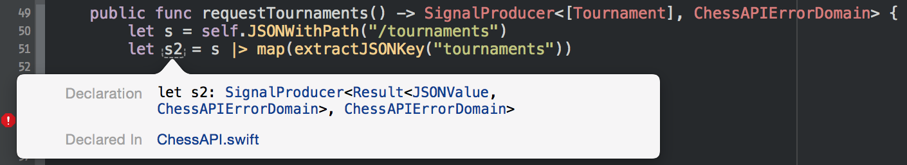

autoscale: true
footer: ReactiveChess - Javier Soto, RACDC 2015
slidenumbers: true
build-lists: true

# [fit] RAC3, A Real World Use Case
### aka
# [fit] ReactiveChess

---

# Javier Soto (@Javi)
### iOS at Twitter

^ - My name is Javi, and I'm super excited to be up here to talk about RAC3.

---

# Prediction:

## *All of the code in these slides won't compile on the latest Xcode by the time you're reading this.*

---


^ - I started using ReactiveCocoa 2 when I was working on the Pebble iOS app, but I reached peak excitement when I got out of the WWDC keynote last year.
- YAY TYPED SIGNALS.

---

# WatchChess.app


^ - Earlier this year, Nacho and I started working on a chess app for the Apple Watch.
- We both love chess, and we wanted a really easy way to follow chess games.

---

# WatchChess.app

^ - But I'm not here to talk about chess (sorry).
- I want to go over a few things that I learned while implementing this app using RAC 3, which I hope some of you will also find useful.

- ReactiveCocoa 3.0
- Argo

# History

- First prototype: Swift 1.2 with Xcode 6.3 Beta 1
- v1.0: Swift 1.1, RAC 3.0 pre-alpha
- v1.1: Swift 1.2, RAC 3.0-beta.1
- v1.2: RAC 3.0-beta.6

^ - The app also uses Carthage (which is built with RAC), and the backend is implemented in RX-Java. So there's FRP all around.

---

# Big Takeaways

- Typed Signals
- Less debugging required
- Conciseness
- Clearer semantics

^ - "Debugging RAC code is hard". Well, I haven't had to do it at all.
- I spend more time getting it to compile, but when it does, I'm way more confident.

---

# Conciseness

```objc
[[[[client
    logInUser]
    flattenMap:^(User *user) {
        return [client loadCachedMessages:user];
    }]
    flattenMap:^(NSArray *messages) {
        return [client fetchMessagesAfter:messages.lastObject];
    }]
    subscribeNext:^(NSArray *newMessages) {
        NSLog(@"New messages: %@", newMessages);
    } completed:^{
        NSLog(@"Fetched all messages.");
    }];
```

^ - Example from the RAC2 docs.
- The "shape" of this code was one of the reasons RAC was often critized.
- There's nothing terribly bad about it, but there's a low signal to noise ratio.

---

# Conciseness

```swift
client.loginUser()
    |> flatMap(.Latest) { client.loadCachedMessages($0) }
    |> flatMap(.Concat) { client.fetchMessagesAfter($0.last) }
    |> start(next: { println("New messages: \($0)") },
        completed: { println("Fetched all messages.") })
```

^ - This is what the exact same code looks like in RAC3.
- We can focus on our code, because the language kind of gets out of the way.

---

# Biggest sources of frustration

- Compiler crashes
- Type errors

^ - We can't do a lot about the former, but should get better over time. I hear that Swift 2b1 has fixed a big number of them.
- Type errors have been, to me, the hardest thing about writing RAC code.
- I'd like to show you how I approached them, and I hope to save you a little bit of .

---

# *Figure out type errors in RAC 3 with this one weird trick*

^ - Swift does a poor job at pointing at the right thing.
- Here's just an example of the steps I take to attempt to figure it out.

---

# Type Errors

WAT


^ - As soon as your RAC3 code reaches any minimum complexity, you're gonna run into one of these.

---

# Type Errors

Extract intermediate results into separate values


^ - My #ProTip is simply to extract the intermediate signal results into different variables like this.

---

# Type Errors

Inspect the types (⌥ + click)


^ - When we do this, we can use Opt-click to inspect the types of each variable.

---

# Type Errors

Inspect the types (⌥ + click)

^ - Not only this may help you reason about what you may have done wrong, but it will also help Swift, and the error message it may provide now may make a lot more sense.



---

# Type Errors

Check RAC's function signatures (⌘ + click)

^ - If the Swift error message still doesn't make any sense, then we have to look at the function signature...


---

# Type Errors

Check if your types match those expected by RAC


^ - ...and compare the types with the types of the values we're passing, to see what we're doing wrong.
^ - In this case we're passing a function that returns a `Result` type, but we're using `map`.

---

# Type Errors

Look for a function that matches what you're trying to do


^ - If we search through the Signal methods, we may find `tryMap`, which expects a function that returns a Result. Probably what we want in this case.
- (These screenshots are actually a bit outdated, this method is now known as `attemptMap`)

---

# Type Errors

^ - Now the type checker is happy, so we know the code will work.

*If it compiles, it works*.


^ - OK, this is maybe not 100% true, but I'm definitely much more confident than I was writing Obj-C with RAC3.

---

# `ChessAPI.swift`

---

# `ChessAPI.swift`

```swift
enum APIError: ErrorType {
  case NetworkError(NSError)
  case JSONParsingError(NSError)
  case InvalidJSONStructure(reason: String)
}
```

^ - Huge fan of having my own error types, instead of the fragile NSError domains and codes.
- Now this `ErrorType` protocol is part of the Swift2 stdlib!

---

# `ChessAPI.swift`

```swift
import ReactiveCocoa
import Argo

func tournaments() -> SignalProducer<[Tournament], APIError> {
    return self.JSONWithPath("/tournaments")
        |> attemptMap(extractJSONKey("tournaments"))
        |> attemptMap(extractJSONObjects)
        |> reverse
}
```

^ - SignalProducer: clearer semantics. I know what to expect from it. We don't use Signal in the whole app.
- Composing the tasks that are involved in getting that array of tournaments from a series of extremely simple functions that are much easier to reason about.
- Let's look at `JSONWithPath()`

---

# `ChessAPI.swift`

```swift
func JSONWithPath(path: String) -> SignalProducer<JSON, APIError> {
    let request = APIRequestWithPath(path)
    let URL = request.URL

    return self.urlSession.rac_dataWithRequest(request)
        |> log(started: "Started: \(URL)",
               completed: "Finished: \(URL)")
        |> mapError { APIError.NetworkError($0) }
        |> map { $0.0 }
        |> attemptMap(parseJSON)
    }
```

^ - This type signature makes it really clear what you'll get out of it. No more `RACSignal` sadness.
- The important bits of this function is that we take an NSData signal, and we transform it by parsing the JSON.

---

# `ChessAPI.swift`

```swift
func parseJSON(data: NSData) -> Result<JSON, APIError> {
    var error: NSError?
    if let json = NSJSONSerialization(data, error: &error) {
        return success(JSON.parse(json))
    }
    else {
        return failure(APIError.JSONParsingError(error!))
    }
}
```

^ - Example of really simple function that applies a failable transformation on some data.
- Custom error.
- This could now be a `throws` function, but I still like this better.

---

# Custom RAC Operators

^ - You've seen some functions that we've used with the pipe-forward operator (|>) that are not provided by RAC3.

---

# Custom RAC Operators

```swift
return self.urlSession.rac_dataWithRequest(request)
       |> log(started: "Started: \(URL)",
              completed: "Finished: \(URL)")
```

^ - This `log` function is not defined by RAC, yet we can use it with |>
- Creating small functions like this allows us to reuse a lot of code, while keeping the definitions of our signals really expressive.

---

# Custom RAC Operators

### `log()`:

```swift
func log<T, E: ErrorType>(started: String = "",
                         next: String = "",
                         completed: String = "")
                         (producer: SignalProducer<T, E>)
                         -> SignalProducer<T, E> {
    return producer
           |> on(started: { println(started) },
                 next: { println(next + " \($0)") },
                 completed: { println(completed) })
}
```

^ - This is how it would be implemented. Let's see how it works.

---

# Custom RAC Operators

### `log()`:

```swift
func log<T, E: ErrorType>(started: String = "",
                         next: String = "",
                         completed: String = "")
                         (producer: SignalProducer<T, E>)
                         -> SignalProducer<T, E>

(String, String, String) -> SignalProducer -> SignalProducer
```

^ - This is the type of the function.
- Takes a tuple of 3 strings, a producer, and gives you a producer just like the one you passed, but after injecting the side effect of logging to the console.
- Note the placement of the parens. It's a curried function, which simply means we can call it "in 2 steps".

---

# Custom RAC Operators

### `log()`:

```swift
(String, String, String) -> SignalProducer -> SignalProducer
log("someMessage"): SignalProducer -> SignalProducer
```

^ - After calling it with a string, what we have left is a function that goes from Producer to Producer.

### `|>`:

```swift
(SignalProducer, (SignalProducer -> SignalProducer)) -> SignalProducer
// Infix order would be...
// SignalProducer |> (SignalProducer -> SignalProducer) -> SignalProducer
```

^ - There are several definitions of |> (it's overloaded), but the one of interest here is this one.
- I've laid out the types without the generic type parameters for simplification.
- It takes a producer, and a function that knows how to transform a producer, and gives you a producer after doing sth w/ that producer.

---

# Custom RAC Operators

```swift
return self.urlSession.rac_dataWithRequest(request)
       |> log(started: "Started: \(URL)",
              completed: "Finished: \(URL)")
```

^ - The original producer, the first parameter to |> is the first line.
- The log function, after calling it with a string, like we saw earlier, gives us a Producer -> Producer function, so that way the types align.

---

# WatchKit Controllers

```swift
import WatchKit
class TournamentsInterfaceController: WKInterfaceController {
  private let tournaments = MutableProperty<[Tournament]>([])

  override init() {
    super.init()

    self.tournaments.producer |> skip(1)
      |> skipRepeatedArrays
      |> start(next: { [unowned self] tournaments in
        self.updateUIWithTournaments(tournaments)
      })
  }

  override func willActivate() {
    self.tournaments <~ self.chessAPI.requestTournaments()
      |> printAndFilterErrors("Error requesting tournaments")
      |> observeOn(UIScheduler())
  }
}
```

^ - And this is how we use ChessAPI in the controllers.
- Could be simpler, and we could extract into a view model.
- We get a really easy way to make sure that if we make multiple requests and get the same results, we don't send all the data again to the watch (`skipRepeatedArrays`)

---

# WatchKit Controllers

```swift
self.tournaments <~ self.chessAPI.requestTournaments()
    // To bind to a property, the signal can't send errors.
    |> printAndFilterErrors("Error requesting tournaments")
}
```

^ - Another operator that simply logs the errors in the console and transforms the signal so that we can bind it to the property.

---

# `printAndFilterErrors()`

```swift
func printAndFilterErrors<T, E: ErrorType)(message: String)
                                          (signal: Signal<T, E>)
                                          -> Signal<T, NoError> {
    return signal
           |> on(error: { println("\(message): \($0)") })
           |> catch { SignalProducer<T, NoError>.empty }
}
```

^ - This is how it's implemented.

---

# WatchKit Controllers

```swift
self.tournaments.producer
    // Easy optimization to minimize Bluetooth round-trips.
    |> skipRepeatedArrays

    |> start(next: { [unowned self] tournaments in
      self.updateUIWithTournaments(tournaments)
    })
```

---

# `skipRepeatedArrays()`

```swift
public func skipRepeatedArrays<T: Equatable, E>(signal: Signal<[T], E>)
                              -> Signal<[T], E> {
	return signal |> skipRepeats(==)
}
```

^ - Simple work-around for the fact that Array doesn't conform to Equatable.
- This should get a lot better in Swift2.

---

# THANKS

- Justin Spahr-Summers ([@jspahrsummers](https://twitter.com/jspahrsummers))
- Nacho Soto ([@NachoSoto](https://twitter.com/NachoSoto))
- You

---

# Questions?
