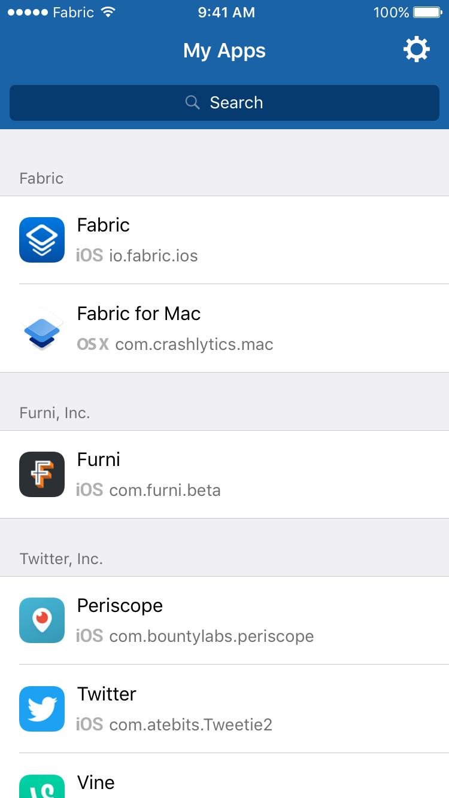
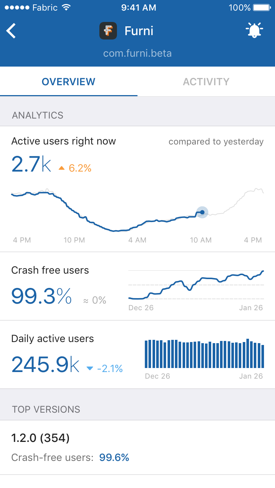
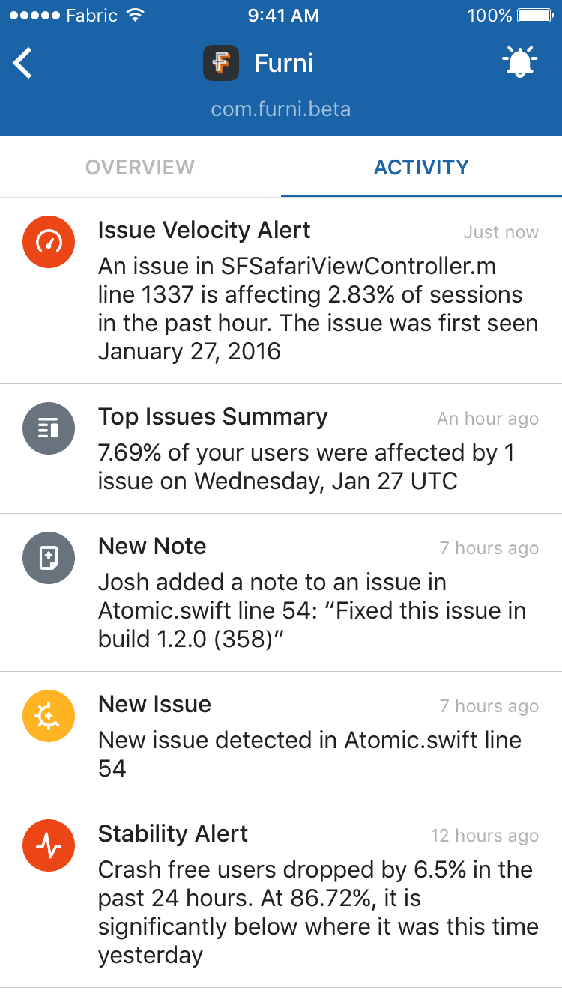
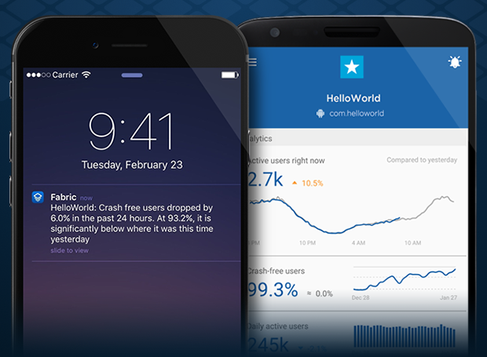
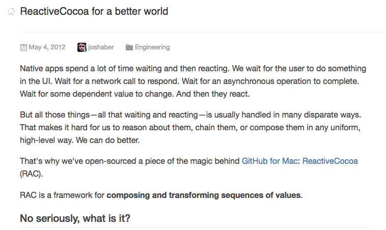
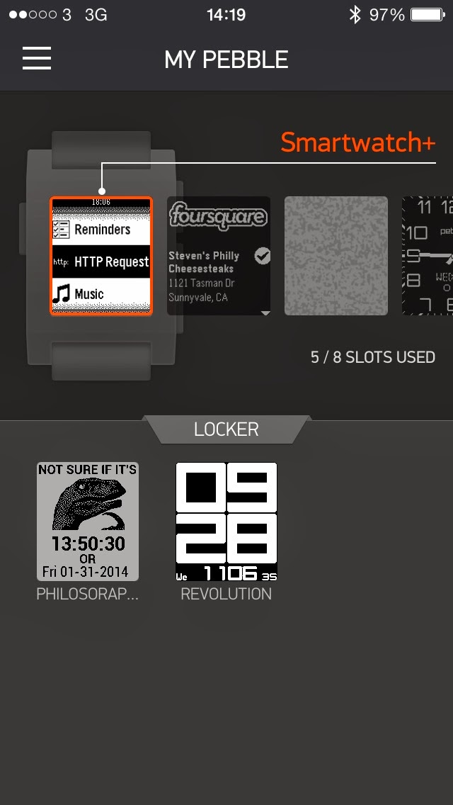

theme:plain-jane
footer: "Building Fabric.app with ReactiveCocoa" - Javier Soto. RACDC2016 - April 2016
slidenumbers: true
autoscale: true

# [fit] Building Fabric.app with ReactiveCocoa

^ - Welcome!

---

# Intro

   

### @Javi

^ - So a quick intro. My name is Javi. I'm originally from Madrid, Spain. I've been working in the Bay Area for 4 years.
- Previously I worked at Pebble, the Kickstarter funded SmartWatch, on the iOS app.
- I started writing Swift when it first came out, and last year my brother Nacho and I released our first app written in Swift (1.1 at the time): WatchChess for the Apple Watch.
- Since late 2014 I work at Twitter in San Francisco, on the Fabric team.
- You can follow me on Twitter, I go by @Javi.

---

# Outline

- Intro
- History
- Contributing to ReactiveCocoa
- Fabric App Architecture
- RAC examples from Fabric App

^ - This is what I want to cover today. ReactiveCocoa is quite a big topic, but I thought that sharing some of my real-world experience with it building an app might be interesting or useful for some of you.
- I was very lucky when I started working on the iOS app for Fabric. I was the only engineer working on it, and that allowed me to make choices that in many other contexts would have been hard to sell, like using ReactiveCocoa. So I feel very fortunate to have had that opportunity, and to be able to share that with you here today.
- Feel free to interrupt me at any point to ask a question.

----

# Intro: What is Fabric.app?





^ - Quick show of hands, how many of you use the app?
- Quick intro, Fabric is a set of tools for mobile developers.
- The 2 main ones that most of you may be familiar with are Crashlytics, and Answers.
- If you follow me on Twitter I hope you'd agree with me that I don't like to spam with the things that I work on and try to oversell them. So I won't say I'm not biased, but I want to try to share my personal opinion about this app, and not try to tell you it's awesome just to convince you to get it.
- Building developer tools often means that you get to use the tool you're using to build the tool, which is very meta. So I can talk about the Fabric app not as an author of it, but also as a user. And the Fabric app has become an invaluable tool to rely upon when building an iOS app.

----

# What is Fabric.app?

 

^ - The app can send you notifications if there's a stability issue. This may sound like hell. Believe me, I'm the first one that would hate to be on call. But when things are working OK, NOT getting notifications is actually a huge relieve. Just by having the app installed I can know that things are OK, and I don't have the anxiety that MAYBE I should look at the Crashlytics dashboard every now and then to see if there's a problem.

---

# History



https://github.com/blog/1107-reactivecocoa-for-a-better-world

^ - OK, I'm done selling the app, I promise!
- Matt already went over this at the State of the Union but I wanted to share my personal story of how I came into the ReactiveCocoa world.
- I remember very clearly reading this blogpost and the impression it gave me. It definitely made me feel really dumb.

---

# History

- ReactiveCocoa 1: May 2012 (Objective-C)
- ReactiveCocoa 2: September 2013 (Objective-C)
- ReactiveCocoa 3: September 2015 (Swift 1)
- ReactiveCocoa 4: January 2016 (Swift 2)

^ - This is a brief overview of the evolution of ReactiveCocoa.

---



^ - I Started using ReactiveCocoa 2 in Objective-C in the v2 of the Pebble app.
- When I started using it, I had no idea what I was doing. You may think of me as a core contributor, or as a ReactiveCocoa expert, or something like that because I'm up here talking to you today. But really, I'm just a normal developer, who one day got really curious about the ideas in that blog post.

---

### Contributing to ReactiveCocoa

^ - Let's talk about contributing to ReactiveCocoa.
- I think you're all here today because you share that same curiosity. You know you could just use the APIs and patterns that Apple provides, but you're open to learning, trying and using different approaches to building an app.
- If you look at my actual contributions to ReactiveCocoa however, I have written very very little code! I wanted to encourage all of you to consider all the ways in which one can help out in this open source project (this applies to any project)

---

## Contributing to ReactiveCocoa: Coding

- Refactoring
- New tests
- Proposing new operators
- Compatibility with new Swift versions

^ - So of course, contributors help out with the code. But I'm sure most didn't start this way.
- Being comfortable enough to contribute code can take a while. For me personally, a lot of the ReactiveCocoa implementation details are still basically magic.

---

## Contributing to ReactiveCocoa: Other ways!

- Replying to issues
- Writing / improving docs
- Helping other users
- Evangelizing

^ - But these are other ways which are incredibly valuable to the project as well. And one doesn't need to know the ReactiveCocoa internals to do any of this. If you're a user of RAC, you're more than capable to take on some of these tasks.
- And you don't have to feel like you have to commit for a certain number of hours a week. Any small help is very appreciated by the rest of contributors, and will be appreciated by the whole RAC community!
- I want to take a moment to appreciate the huge effort that people like Matt, Rui, and Nacho put into ReactiveCocoa. And that work doesn't just touch ReactiveCocoa, it has far-reaching effects. For example, the building of the Fabric App was greatly simplified thanks to RAC, so Fabric's users may not know it, but they have to be very thankful for the work that all the contributors have put over time.

---

# Fabric App Architecture

^ - Alright, let's talk a bit about how we built this app.

---

# Fabric App Architecture

- FabricAPI.framework:
	- Networking
	- Models
- Fabric App:
	- View Controllers
	- View Models

^ - At a very high level, these are the components.
- ReactiveCocoa fits into the boundaries between all of them. It is the pipes that allow data to pass through the application.

---

## Examples of Usage of ReactiveCocoa in the Fabric App

---

## Examples - Networking

```swift
final class AuthenticatedFabricAPI {
	func applications() -> SignalProducer<[Application], FabricAPIError> {
		return apiNetworking.requestJSONProducer(
				URL: APIURL(path: "api/v3/projects"),
				method: .GET
			)
			.attemptMap(Application.decodeObjectsInJSON)
			.observeOn(UIScheduler())
	}
}
```

^ - It kind of all starts here. One of the first things that I implemented: getting data from your Fabric account.
- Network requests is one of the obvious use-cases of Reactive APIs. But once you have this working, it cascades to the rest of the app, with the power of ReactiveCocoa's operators to compose signals.

---

## `DataLoadState`

```swift
final class MyViewModel {
	var data: MyEntity?
}
```

^ - This sort of code is not out of the ordinary. The view model exposes the data that will be presented, and because there are network requests involved, things take a while to load, may fail, etc.
- So if this data value is nil, what can we say? Is it loading? Has it failed to load?
- This is often an important distinction, so that we can surface the right information to the user.
- I've noticed many apps, e.g. the WWDC app get this wrong.

---

## `DataLoadState`

```swift
enum DataLoadState<DataType> {
	case Loading
	case Failed
	case Loaded(DataType)
}
```

^ - Because this kept being an issue in the app, I decided to model it explicitly, so I created this simple `DataLoadState` abstraction.
- The reason why I wanted to show it here is to show an example of how we can extend ReactiveCocoa to play very nicely together with an API that you may create in your app.

---

## `DataLoadState`

```swift
enum DataLoadState<DataType> {
	case Loading
	case Failed
	case Loaded(DataType)
}

extension SignalProducerType {
	func materializeToLoadState() -> SignalProducer<DataLoadState<Value>, NoError> {
		let producer = self
			.map(DataLoadState.Loaded)
			.startWithValue(DataLoadState.Loading)

		return producer.ignoreErrors(replacementValue: DataLoadState<Value>.Failed)
	}
}
```

^ - In this case we can take a `SignalProducer`, for example, one responsible for making a network request, and make it report the state in terms of `DataLoadState`.
- This is how simple the implementation is. We'll see how that `ignoreErrors` works later.
- This a slightly simplified version of the code in the app. There's a bit more of code to be able to redirect the errors into another producer so that they can be consumed separately in case you want to present more error information to the user.

---

```swift
extension SignalProducerType where Value: DataLoadState {
	func ignoreLoadingAndErrorsAfterSuccess() -> SignalProducer<DataLoadState<Value.DataType>, Error> {
		var hasSuccededOnce = false

		return self.filter { value in
			defer {
				if value.success {
					hasSuccededOnce = true
				}
			}

			return !hasSuccededOnce || value.success
		}
}
```

^ - And this is another simple operator we can add. With this, if we have some reloading policy, we can make sure that the UI doesn't show a loading spinner while we're reloading to get more fresh data.

---

## Examples - View Models

```swift
typealias ApplicationLoadState = DataLoadState<[Application]>

final class ApplicationListViewModel {
	let applications: AnyProperty<ApplicationLoadState>
	private let applicationsMutableProperty = MutableProperty(ApplicationLoadState.loading())

	init(fabricAPI: AuthenticatedFabricAPI) {
		self.applications = AnyProperty(self.applicationsMutableProperty)

		self.applicationsMutableProperty <~ fabricAPI.applications().materializeToLoadState()
	}
}
```

^ - And this is an example of how ViewModels across the Fabric app are structured, using `DataLoadState`.
- The expose an immutable property of the state to load some resources.
- And this slide contains one of my favorite things that ReactiveCocoa brings to the app, but it's invisible!
- The request to get the resources the screen that will use this view model is started by the mutable property where the producer is being bound to.
- If the mutable property is deallocated, the subscription to the producer will be disposed, and if the request hasn't finished yet, it'll be cancelled. This is a fantastic optimization that we get absolutely for free. And turns out this is a very common scenario: if a view controller is deallocated because it goes off screen, it will release the view model, which will release the property.
- In plain English, what this means is that, across the whole Fabric app, all requests are somehow owned by a screen, and when that screen goes away, all those requests are immediately cancelled. This is a great optimization that can save battery and more importantly, data.
- Imagine having to implement that optimization manually. I think it's safe to say that most apps don't, just b/c it would be a lot of boilerplate, and it's a lot easier to just "fire and forget". Use [weak self] on the request callbacks, and just ignore the responses if the screen went away when it finishes.

---

## Examples - Consuming Data From a View Model

```swift
self.viewModel.applications.producer.startWithNext { applicationsLoadState in
	switch applicationsLoadState {
		case .Loading:
			label.text = "Loading..."

		case .Failed:
			label.text = "Error loading applications!"

		case .Loaded(let applications):
			reloadTableView(applications: applications)
	}
}
```

^ - And this is an example of how we can consume it outside of the view model.

---

# ReactiveCocoa Extensions

^ - Next, I want to show some somewhat simple extension methods I implemented over time. I wanted to show these mainly as inspiration: ReactiveCocoa provides a set of building blocks, but we also made a conscious effort to limit the API surface. This means that there are many methods that we could implement, but chose to not add for different reasons. But Swift makes it really easy to add new API to a module from outside in a way that those APIs are indistinguishable from the first-party ones.

---

```swift
extension SignalProducerType {
	func startWithValue(value: Value) -> SignalProducer<Value, Error> {
		return SignalProducer(value: value).concat(self.producer)
	}
}
```

^ - The first example is actually an API that was just added to RAC (although with a different name: `prefix`).
- The implementation is trivial. In fact, it's so easy, that it's very easy to repeat that code over and over throughout the app. The lesson here I think is to try to look for opportunities to factor out simple helpers like this one into operators that you can reuse with a clear name.

---

# ReactiveCocoa Extensions

```swift
extension SignalProducerType {
	func startWithNil() -> SignalProducer<Value?, Error> {
		return self
			.map(Optional.init)
			.startWithValue(nil)
}
```

^ - This is a very similar one, but it doesn't exist in ReactiveCocoa (yet). The reason why this is a different method is that this can change the type of the Producer to an optional, which can be really useful.

---

# ReactiveCocoa Extensions

```swift
extension SignalProducerType {
	func ignoreErrors(
		replacementValue replacementValue: Self.Value? = nil
	) -> SignalProducer<Value, NoError> {
        return self.flatMapError { _ in
            return replacementValue.map(SignalProducer.init) ?? .empty
        }
    }
```

^ - We saw some code in an earlier slide that call this method, this is the implementation. Not super interesting, but if you're curious about how to implement a method kind of like this one, it may help as reference. You can check it out offline if you want, the slides are in my Github account.

---

# ReactiveCocoa Extensions

```swift
extension SignalProducerType {
	func failRandomly(withError error: Self.Error) -> SignalProducer<Value, Error> {
		return self.attemptMap { value in
			let shouldFail = arc4random() % 3 == 0

			return shouldFail ? Result(error: error) : Result(value: value)
	}
}
```

^ - This is a fun one that we actually compile only on DEBUG builds to make sure we don't accidentally leave it in a production build. I often add this to some network request to check out the behavior of some feature when the requests fail.

---

# ReactiveCocoa Extensions

```swift
extension NSProcessInfo {
    var lowPowerModelEnabledProducer: SignalProducer<Bool, NoError> {
        return NSNotificationCenter.defaultCenter()
            .rac_notifications(NSProcessInfoPowerStateDidChangeNotification, object: nil)
            .map { _ in return () }
            .startWithValue(())
            .map { [unowned self] _ in
                return self.lowPowerModeEnabled
            }
            .skipRepeats(==)
    }
}
```

^ - Another great use-case is to wrap Apple's APIs to be able to use them with a RAC interface, such that we can compose them more easily with other work.
- This one lets us query whether low power mode is enabled or disabled over time, so that we can choose to not do some expensive work if it is.

---

# ReactiveCocoa Extensions

```swift
let shouldReload = combineLatest(
	viewIsOnScreen,
	NSProcessInfo.processInfo().lowPowerModelEnabledProducer.map { !$0 }
).map { $0 && $1 }

let reloadPeriodically = shouldReload
	.flatMap(.Latest) { [unowned self] shouldReload in
			return shouldReload ?
				timer(30, onScheduler: scheduler).map { _ in () }
				: .empty
	}

let request = reloadPeriodically.flatMap(.Latest) { someAPIRequest }
```

^ - This is an example of that in use. Some screens reload its data automatically, and we can choose not to do that if the user is trying to save battery.

---

# ReactiveCocoa Extensions

```swift
extension SignalProducerType {
	func continueWhenApplicationIsBackgrounded(
		taskName taskName: String,
		timeoutError: Self.Error
	) -> SignalProducer<Value, Error> {
}
```

^ - `continueWhenApplicationIsBackgrounded` is one of my favorites. It's so easy to take any asynchronous work and ensure that it'll continue with a task assertion in case the user backgrounds the app.

---

# ReactiveCocoa Extensions

```swift
extension SignalProducerType {
	func repeatWith(
		producer: SignalProducer<(), NoError>,
		throttleWithInterval: NSTimeInterval,
		onScheduler scheduler: DateSchedulerType
	) -> SignalProducer<Value, Error> {
        return SignalProducer(value: ()).concat(producer)
            .throttle(throttleWithInterval, onScheduler: scheduler)
            .promoteErrors(Error)
            .flatMap(.Concat) { _ in
                return self.producer
            }
    }
}
```

^ - Repeating requests is something that we do across the app to make sure we show fresh and current data when you come back from the background after a while.
- This is the operator that we implemented.

---

# ReactiveCocoa Extensions

```swift
self.api.request(parameterFoo: bar)
	.repeatWith(
		viewWillAppearProducer,
	 	throttleWithInterval: 60,
		onScheduler: QueueScheduler.mainQueueScheduler
	)
```

^ - And this is an example of how we use it. We can make sure we repeat a request every time a screen appears, but we also make sure we don't do this too often.

---

# Conclusion

^ - Those are all the examples I got.
- I want to finish with some thoughts. If I had to highlight one thing from my experience using ReactiveCocoa is I think that I wouldn't go back to not having a explicit abstraction to model asynchronous data flow. I couldn't help to notice this all over the place in all of the new APIs that were introduced by Apple this week: so many different, ad-hoc ways of doing the same thing, each of them with a slightly different callback-based API.
- I don't know where we'll be in 10 years. I don't know if ReactiveCocoa will be around. I don't know how long it'll take until I'm embarrassed by the code in this presentation, but I am very confident that the ideas that ReactiveCocoa taught me and that took me here, some of which I tried to share with you today, made me a better programmer overall.

---

# Questions?

^ - And that's all I got! If you wanna ask any questions about any part of the presentation, or are curious about how we built anything in the app, I would love to talk to you!
- I've also shared a lot of code snippets from the app as gists, so I'd be happy to share other things if you're curious or there's anything that would be helpful to you.

----

# Thank you! <3 😊
### See you next year!
