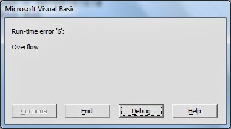
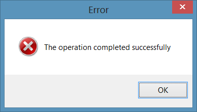

footer: "Back to the Futures" - Javier Soto. March 2015
slidenumbers: true

# Back to the Futures


> -- @Javi

^ - My name is Javi, I'm an iOS Engineer at Twitter in San Francisco.
- Going to show a very useful pattern from Functional Programming, in a very practical way, without using words that start with F or words that start with M.

---

# Agenda

- Traditional Asynchronous Code
- Problems with Traditional Error Handling
- Future
- Future.map
- Future.andThen

---

# [fit] Traditional asynchronous code

^ - Let's talk about the problem first.

---

## Traditional asynchronous code

```swift
struct User { let avatarURL: NSURL }
func requestUserInfo(userID: String, completion: (User?, NSError?) -> ())
func downloadImage(URL: NSURL, completion: (UIImage?, NSError?) -> ())

func loadAvatar(userID: String, completion: (UIImage?, NSError?) -> ()) {
    requestUserInfo(userID) { user, error in
        if let user = user {
            downloadImage(user.avatarURL) { avatar, error in
                if let avatar = avatar { completion(avatar, nil) }
                else { completion(nil, error!) }
            }
        } else { completion(nil, error!) }
    }
}
```

^ - We're used to this in Obj-C, but we can do better in Swift.
- Concatenating asynchronous work means that we need to check for error every step of the way. There surely has to be a better pattern.
- This grows to the right very quickly as soon as you start having to do more and more things.

---

## Traditional asynchronous code


^ - Let's avoid this.

---

## Traditional asynchronous code

```swift
func downloadImage(URL: NSURL, completion: (UIImage?, NSError?) -> ())
```

- (.Some, .None)
- (.None, .Some)
- **(.Some, .Some)**
- **(.None, .None)**

^ - Let's look at a problem with the type signatures.
- This tuple can hold 4 possibilities
- Not a Swift problem: Those question marks are always there implicitly in Obj-C!
- The last 2 cases mean both image and error, and neither image nor error.


---

- **(.Some, .Some)**
- **(.None, .None)**


^ - I always like to remind people that computers never make mistakes: bugs occur when there's a difference between what we think we told the computer to do, and what we actually told the computer to do.
- If we don't have a way of properly expressing our intentions in code, bugs will pop up.

---

## Error Handling

```swift
func downloadImage(URL: NSURL, completion: (UIImage?, NSError?) -> ())

downloadImage(url) { imageOrNil, errorOrNil in
    if error = errorOrNil {
        // What if image is also not nil??
    }
    else if image = imageOrNil {

    }
}
```

^ - Checking the error first is an anti-pattern in Cocoa.
- We couldn't do better in Obj-C, because any reference type can hold nil, but we can do better in Swift.

---

## Error Handling

```swift
var error: NSError?
let string = NSString(contentsOfFile:path encoding:NSUTF8Encoding error:&error)

if string == nil {
    // Oops:
    if error.code == NSFileReadNoSuchFileError {
        // ...
    }
    else if ...
}
```

^ - NSError-based APIs don't give us any information at compile-time about the types of errors we may get.
- In this example: how do we know what domain and codes are possible? NSString's documentation doesn't mention.
- Checking the code without checking the domain is a very subtle bug that NSError doesn't prevent.
- This type of API also makes it possible to ignore errors.
- Robust software must take good care of errors, and ignoring them is a recipe for disaster.

---



^ - We don't spend as much time making our APIs easy to use outside of the happy path.
- We need proper abstractions that allow us to easily handle errors without adding complexity to our code if we want to make our programs correct outside of the happy paths.
- No surprise that we often see errors like these in the apps that we use.

---


---



---

## NSError Alternative

```swift
protocol ErrorType { }

enum UserInfoErrorDomain: ErrorType {
    case UserDoesNotExist
    case UserRequestFailure(reason: String)
    case NetworkRequestFailure(reason: String)
}

extension NSError: ErrorType { }
```

^ - This is what I propose instead of NSError.
- We won't require the use of NSError: instead, we'll define a protocol, so that the clients can use anything as an error type.
- For example, here we have a domain definition, with a close set of error cases, which can also carry additional information, in this case, in the form of strings.

---
## NSError Alternative

```swift
enum NoError: ErrorType { }

let error = NoError(?)
```

^ - We can also define a "no error" type. For what?
- We can't create a NoError error, because we've declared it as an empty enum type.
- Can't create values of that type. This allows us to declare Futures that we know can't come back with errors.
- And this is ensured at compile-time: no need for unit tests!

---

## Result

```swift
enum Result<T, E: ErrorType> {
    case Success(T)
    case Error(E)
}
```

^ - `Result` is what makes the type-contract explicit: no more corner cases!
- Thanks to the user of `enum`, we know that a `Result` value can only hold \_either\_ a value, or an error.
- We restrict E to ErrorType.
- The slides have a little trick: for simplification I ommited the use of Box, which is currently required to work-around a Swift-compiler limitation.

---

# Say hello to
# `Future<T, E>`

^ - With these tools, let's make Future.
- Also sometimes known as Promises.
- We're going to see how we can come up with a very simple API that is going to simplify all of our asynchronous code.

---

## Futures

- Encapsulate a deferred computation.
- Treat values that incur a delay to be retrieved as if they were regular values.
- Allow us to treat errors as first class citizens.
- Easily composable.

^ - Abstracting away the asynchrony, which allows us to simplify the way we describe the operations and transformations we want to apply to those values.
- This pattern has been implemented millions of times in many languages. I hope that by looking at how to implement it, and compare it to what we're used to, we can gain a better understanding of this abstraction.

---

## Future

```swift
struct Future<T, E: ErrorType> {
    typealias ResultType = Result<T, E>
    typealias Completion = ResultType -> ()
    typealias AsyncOperation = Completion -> ()

    private let operation: AsyncOperation
}

```

^ - Defining some intermediate typealiases helps us understand the signatures of these closures.
- Operation is the closure that we can call when we want the Future to start performing the work required to retrieve the value.

---

## Future

```swift
struct Future<T, E: ErrorType> {
    init(operation: AsyncOperation) {
        self.operation = operation
    }

    func start(completion: Completion) {
        self.operation() { result in
            completion(result)
        }
    }
}
```

^ - The initializer allows us to create a Future with the operation closure.
- The start method is the main method of the public API: allows us to tell Future to do the work to retrieve the value asynchronously.

---

## [fit] `Future.map()`: transforming the computed value

^ - Future as is is not very useful. Let's see what APIs we can add that will let us operate with them.

---

## [fit] `Future.map()`: transforming the computed value

```swift
struct User { let avatarURL: NSURL }

func requestUserInfo(userID: String) -> Future<User, ErrorDomain>


func requestUserAvatarURL(userID: String) -> Future<NSURL, ErrorDomain> {
    return requestUserInfo(userID)
    .map { $0.avatarURL }
}
```

^ - If we have a function that can give us a future of a User, we can map it to get a function that will give you a Future of an URL for the avatar.

---

## [fit] `Future.map()`: transforming the computed value

```swift
struct Future<T, E: ErrorType> {
    func map<U>(f: T -> U) -> Future<U, E>
}
```

^ - This would be the type signature.

---

## map() in other types

```swift
struct Array<T> {
    func map<U>(f: T -> U) -> [U]
}

enum Optional<T> {
    func map<U>(f: T -> U) -> U?
}

struct Future<T, E: ErrorType> {
    func map<U>(f: T -> U) -> Future<U, E>
}
```

^ - It's no coincidence that the signature looks exactly the same as in all these other types.
- It allows you to apply a function that transforms T values into other values, when those values are enclosed within a context, whether it's an Array, or an Optional "box".

---

## [fit] `Future.map()`: transforming the computed value

```swift
func map<U>(f: T -> U) -> Future<U, E> {
    // Return a new Future w/ a new operation...
    return Future<U, E>(operation: { completion in

    }
}
```

^ - How would we implement it? It's easy.
- In fact, given the type signature, there's only one way to implement it.

---

## [fit] `Future.map()`: transforming the computed value

```swift
func map<U>(f: T -> U) -> Future<U, E> {
    return Future<U, E>(operation: { completion in
        // Retrieve the value from self...
        self.start { result in

        }
    }
}
```

---

## [fit] `Future.map()`: transforming the computed value

```swift
func map<U>(f: T -> U) -> Future<U, E> {
    return Future<U, E>(operation: { completion in
        self.start { result in
            // Consider .Success and .Error...
            switch result {

            }
        }
    })
}
```

---

## [fit] `Future.map()`: transforming the computed value

```swift
case .Success(let value):
    // Call completion with the transformed value
    completion(Result.Success(f(value)))
```

---

## [fit] `Future.map()`: transforming the computed value

```swift
case .Error(let error):
    // We didn't get a value: no transformation
    completion(Result.Error(error))
```

^ - What we pass in the completion block is essentially the same as the value we're switching on.
- We have to construct a new Result because value is a Result<T, E>, and we need a Result<U, E>

---

## [fit] `Future.map()`: transforming the computed value

```swift
func map<U>(f: T -> U) -> Future<U, E> {
    return Future<U, E>(operation: { completion in
        self.start { result in
            switch result {
                case .Success(let value):
                    completion(Result.Success(f(value)))
                case .Error(let error):
                    completion(Result.Error(error))
            }
        }
    })
}
```

^ - Putting it all together.

---

## [fit] `Future.andThen()`: concatenating async work

^ - What if what we want to do after getting the value from a future is to do something with it that also incurs in a delay?

---

## [fit] `Future.andThen()`: concatenating async work

```swift
func requestUserAvatarURL(userID: String) -> Future<NSURL, ErrorDomain>

func downloadImage(URL: NSURL) -> Future<UIImage, ErrorDomain>


func downloadUserAvatar(userID: String) -> Future<UIImage, ErrorDomain> {
    return requestUserAvatarURL(userID)
    .andThen(downloadImage)
}
```
^ - map() won't work because it requires that the function we pass returns a U value synchronously.
- We can define a `andThen` function that allows you to concat another future.
- Given 2 functions that perform asynchronous work, we can compose them together by concatenating them with an `andThen` function.
- We go from String to a Future of NSURL to a Future of UIImage, all in one line.

---

## [fit] `Future.andThen()`: concatenating async work

```swift
struct Future<T, E: ErrorType> {
    func andThen<U>(f: T -> Future<U, E>) -> Future<U, E>
}
```

^ - This would be the type signature.

---

## [fit] `Future.andThen()`: concatenating async work

```swift
func andThen<U>(f: T -> Future<U, E>) -> Future<U, E> {
    return Future<U, E>(operation: { completion in

    }
}

```

^ - Same as before, we create a new operation...

---

## [fit] `Future.andThen()`: concatenating async work

```swift
func andThen<U>(f: T -> Future<U, E>) -> Future<U, E> {
    return Future<U, E>(operation: { completion in
        self.start { firstFutureResult in

        }
    }
}

```

^ - ...and retrieve the value from the original one.

---

## [fit] `Future.andThen()`: concatenating async work

```swift
func andThen<U>(f: T -> Future<U, E>) -> Future<U, E> {
    return Future<U, E>(operation: { completion in
        self.start { firstFutureResult in
            switch firstFutureResult {
                case .Success(let value): // ...
                case .Error(let error): // ...
            }
        }
    }
}

```

^ - Again, the value we retrieve can mean a success or an error...

---

## [fit] `Future.andThen()`: concatenating async work

```swift
case .Success(let value):
    let nextFuture = f(value)
```

^ - In the success case, we have the value T, and if we apply the function f we're given, we can get the new future we're going to concatenate.

---

## [fit] `Future.andThen()`: concatenating async work

```swift
case .Success(let value):
    let nextFuture = f(value)

    nextFuture.start { finalResult in
        completion(finalResult)
    }
```

^ - We can start the new future right away, and when we get the value, call the initial completion closure.

---

## [fit] `Future.andThen()`: concatenating async work

```swift
case .Error(let error):
    completion(Result.Error(error))
```

^ - The case of error looks just like in map: we didn't get the value `T`, so we can't apply the f function to continue, we must bail out and report the error to the caller.

---

## [fit] `Future.andThen()`: concatenating async work

```swift
func andThen<U>(f: T -> Future<U, E>) -> Future<U, E> {
    return Future<U, E>(operation: { completion in
        self.start { firstFutureResult in
            switch firstFutureResult {
                case .Success(let value): f(value).start(completion)
                case .Error(let error): completion(Result.Error(error))
            }
        }
    })
}
```

^ - This is what it looks like putting it all together.
- The implementation looks an awful lot like map(). In fact we could implement one in terms of the other.

---

# Recap

^ - Let's look at what we've accomplished.

---

## We went from this...

```swift
func loadAvatar(userID: String, completion: (UIImage?, NSError?) -> ()) {
    requestUserInfo(userID) { user, error in
        if let user = user {
            downloadImage(user.avatarURL) { avatar, error in
                if let avatar = avatar {
                    completion(avatar, nil)
                } else {
                    completion(nil, error)
                }
            }
        }
        else { completion(nil, error) }
    }
}
```

---

## ... To this

```swift
func requestUserInfo(userID: String) -> Future<User, UserInfoErrorDomain>

func downloadImage(URL: NSURL) -> Future<UIImage, UserInfoErrorDomain>


func loadAvatar(userID: String) -> Future<UIImage, UserInfoErrorDomain> {
    return requestUserInfo(userID)
    .map { $0.avatarURL }
    .andThen(downloadImage)
}
```

^ - No explicit error handling everywhere, but errors are being sent through.
- The `loadAvatar` function expresses with little noise what it needs to do to retrieve the values.

---

# Limitations of Futures

- Only represent computation to retrieve one value.
- Can't encapsulate streams of values.
- Only consumer (pull) driven, not producer (push) driven.

^ - While a very useful abstraction, and we saw how it can dramatically improve traditional asynchronous code, it has a very important limitation.
- Futures or promises fail to represent another very common use case: continuous streams of values. They only encapsulate one value, but sometimes we deal with things like user interaction events or application state changes, which are continuous and producer driven, not consumer driven, like what we just showed.

---

# ReactiveCocoa

## Signals > Futures

^ - Signals are in a way a superset of Futures, and therefore they're a more useful abstraction.
- They make RAC an incredibly powerful tool.
- If I've convinced you that this API can help simplify your code, then check out ReactiveCocoa.
- RAC3 written in Swift is coming soon, alpha available.

---

## Follow-up Resources

- Playground: https://github.com/JaviSoto/Talks
- ReactiveCocoa: https://github.com/ReactiveCocoa/ReactiveCocoa
- Railway Oriented Programming: http://fsharpforfunandprofit.com/posts/recipe-part2/

^ - Colin is going to talk about ReactiveCocoa right after this talk.

---

# Thanks!

### *Questions?*
