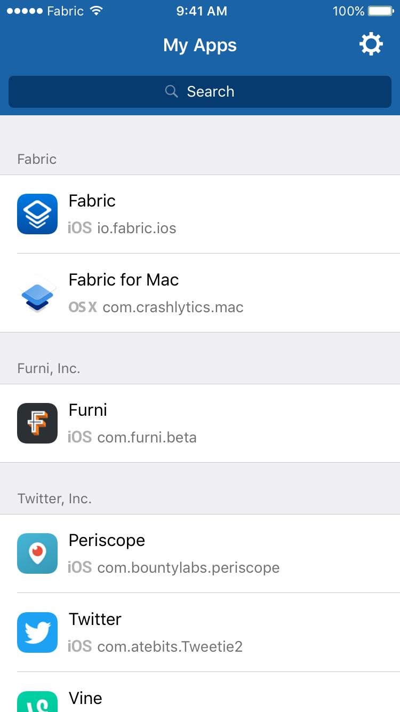
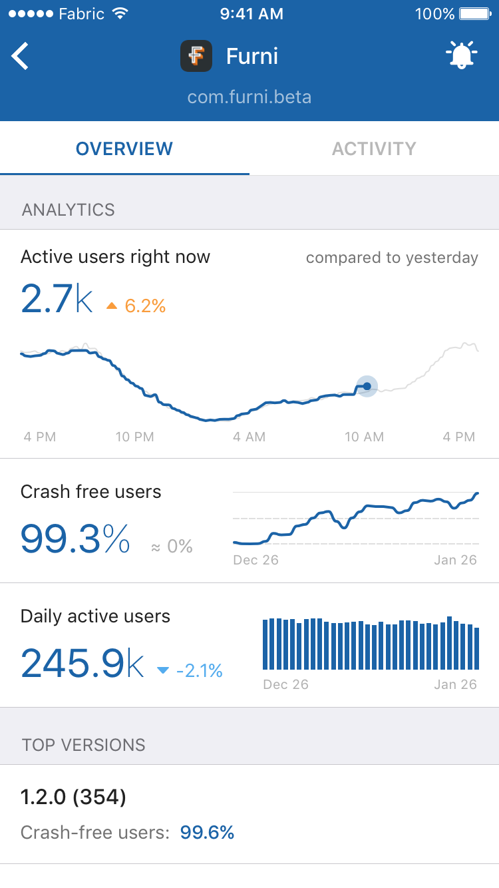
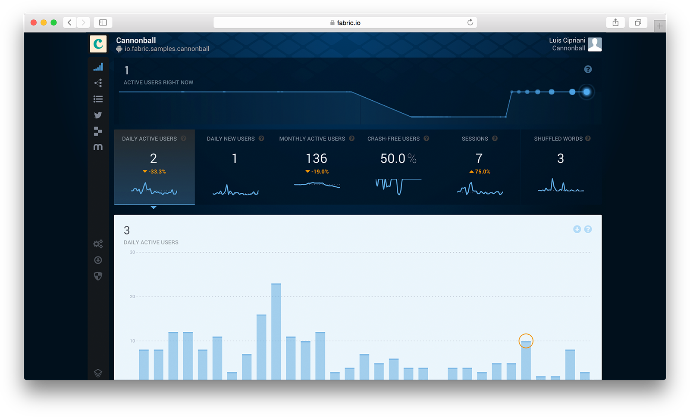
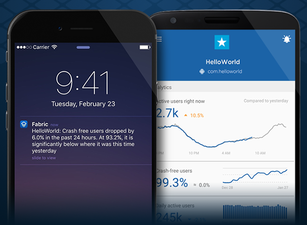
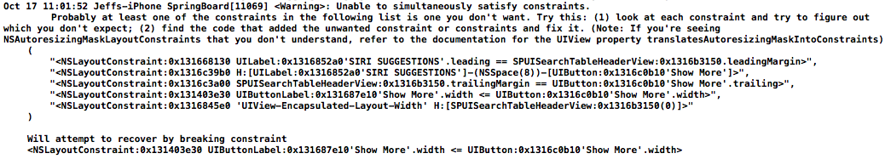
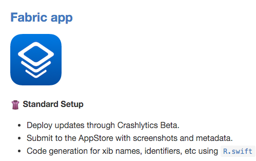
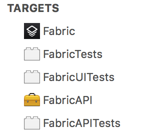
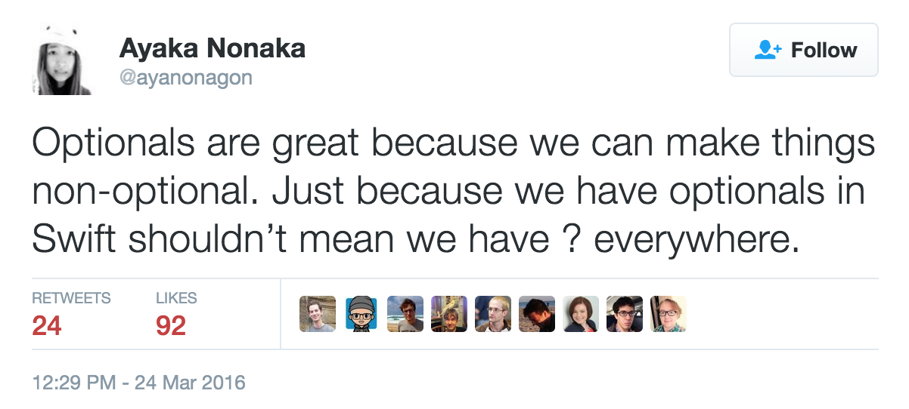
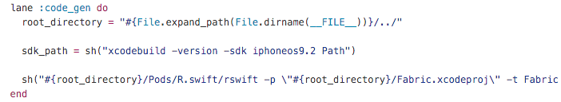
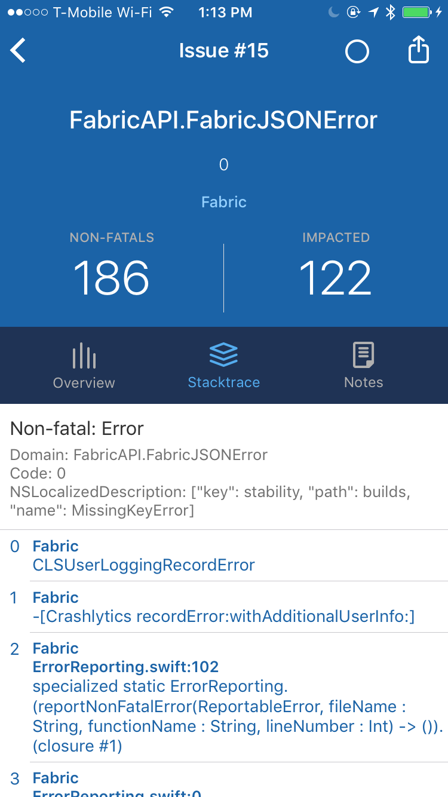

footer: "Building Fabric.app in Swift" - Javier Soto. April 2016
slidenumbers: true
autoscale: true

# [fit] Building Fabric.app in Swift

^ - Welcome!
- Thanks for coming! I love what Realm does for the Swift community hosting these meetups, and I'm super humbled that I get to speak here.

---

# Intro

   

### @Javi

^ - So a quick intro. My name is Javi. I'm originally from Madrid, Spain. I've been working in the Bay Area for 4 years.
- Previously I worked at Pebble, the Kickstarter funded SmartWatch, on the iOS app.
- I started writing Swift when it first came out, and last year my brother Nacho and I released our first app written in Swift (1.1 at the time): WatchChess for the Apple Watch.
- Now I work at Twitter in San Francisco, on the Fabric team.
- You can follow me on Twitter, I go by @Javi.

---


^ - This is also me.
- I love talking about Swift, so I'm really happy to be here.

----

# Outline

- What is Fabric.app?
- Tools used
- Architecture
- Better with Swift
- Error reporting

^ - But anyway, this is what I wanna chat about today. Building the Fabric app was a lot of fun.
- Coming up with specific things to cover about it was a bit tough. Everyone has their own set of best practices, and we all love to evangelize the tools that we love.
- Instead of that, I'd simply like to share some of the things that I did differently when building this app compared to other apps I built in the past.
- There may not be a common theme there, but these are some of the things I found interesting while building this app.
- And hopefully some of that can serve as inspiration, or if anything, I hope it will at least be interesting!
- Feel free to interrupt me at any point to ask a question.

----

# What is Fabric.app?





^ - Quick show of hands, how many of you use the app?
- Quick intro, Fabric is a set of tools for mobile developers.
- The 2 main ones that most of you may be familiar with are Crashlytics, and Answers.
- We set out to build a mobile app because we realized from experience that sometimes important issues don't happen when you're at your desk. Many of us like to be able to keep an eye on how our app is doing no matter where we are.

----

# What is Fabric.app?



^ - This is what the Fabric dashboard looks like on the web. We show you a ton of real-time and historic information about the usage and stability of your app.
- When we started building the mobile app, we didn't want to just replicate what you can see on the dashboard. We wanted the app to shine in mobile.
- And one of the things that we can do great in mobile is notifications.

----

# What is Fabric.app?

 

^ - So the Fabric app is able to alert you if there's something very wrong, like the overall crash-free-users dropping very quickly.
- But we also put a lot of attention to how noisy notifications can be, and we offer fine-grained controls to how many notifications you want to receive, as well as the ability to mute the app for 2 hours or an entire day. Cause nobody wants to hear about their app crashing when you're on vacation!

----

# Tools

^ - OK, so what are some tools that we used to build the app?

----

# Dependency management

^ - Let's start with dependency management.
- Why dependency management? There's a lot of talk recently about how many 3rd party libs you should use in your app, or whether you should use any at all.
- Perhaps in a big team with the resources to solve every single problem required to build an app, I can get behind the idea that you want to minimize the number of external dependencies.
- But the Fabric app had a total of 1 engineer during most of its development time.
- It started as a proof of concept: what could a great Fabric app be?
- Definitely an initial goal was to avoid reinventing the wheel.

----

### Dependency management

- SSL Pinning
- Keychain
- 1Password integration
- Graphs
- Networking, caching

^ - These are problems that, regardless of the complexity in solving them, I didn't want to spend additional time solving, when other people have done an excellent job at it.
- The iOS OSS community is fantastic, there's a ton of really great code out there.

----

### Dependency management

- CocoaPods
- Carthage

^ - So the Fabric app uses both Cocoapods and Carthage. And you're probably wondering "why".
- Using more than one dependency management system is definitely not recommended, because they won't be able to see each other's dependency graph, so the same dependency could be resolved twice.
- However, if you know what you're doing, both of these systems have their advantages.

----

### CocoaPods

- More widely adopted
- Less work to integrate frameworks
- Easily link some frameworks only in Debug

^ - First, Cocoapods.
- Cocoapods libraries are easier to integrate since it sets up the Xcode project for you.
- But to me the biggest win is to easily add a dependency only on debug builds. We use this a ton to add some tools that help us during development, but don't wanna ship in the final binary.

----

### Carthage

- Precompilation == Speed

^ - But we also use Carthage. This is THE reason we use Carthage for some dependencies: app compilation speed.
- The Swift compiler is not as fast as the Obj-C compiler. While it may get better, I believe this may always hold true, and pre-compiling code that you're not constantly changing is a great idea.
- Unfortunately there's been Xcode and lldb issues related to pre-compiling Swift libraries outside of the main Xcode project for over a year now, so this definitely comes with trade-offs.

----

### Swift Package Manager

^ - In the near future, I can't wait to move everything over to SPM, as soon as the Xcode integration is in good shape.

---

### Interface Builder

^ - Next: Interface Builder. I'm a big fan of IB.
-  There's very very little layout code in the Fabric app. Only some views that must dynamically create constraints, and we use the Cartography library for that.
- Being able to set up AutoLayout constraints in Interface Builder greatly reduces the amount of UI code we need to write in the app.

----

### AutoLayout

^ - Despite all the complexities, one of the biggest wins of AutoLayout is self-sizing table view cells.
- In the pre-AL world, apps with table view cells with dynamic heights required a non-trivial amount of manual layout and sizing code. This is horrible for quick iteration.
- That's not to say that AutoLayout is perfect or easy to use.

---

### AutoLayout



^ - An example of this is connecting your phone to your mac and looking at the logs that Springboard spits out:

---

### Storyboards

^ - I want to call out something about Storyboards.
- Version 1.0 of the Fabric app shipped with most of the UI in one storyboard. I started building the app with them because I hadn't done it before and wanted to give it a try.
- When my co-worker Josh joined the team, we quickly realized it wasn't going to work well with more than one commiter, and so in version 1.1 everything was moved to separate .xib files.
- Besides the well known issues with putting all of your UI in one, or perhaps a few different storyboard files, I want to talk about why I would stay away from storyboards altogether.

---

### UIStoryboard

```swift
class UIStoryboard {
	func instantiateViewControllerWithIdentifier(_ identifier: String) -> UIViewController
}
```

^ - This is the only API available to instantiate a controller from a Storyboard.
- If they're being instantiated through segues, that's essentially using this API too.

----

### UIStoryboard

```swift
let vc = mainStoryboard.instantiateViewControllerWithIdentifier("ApplicationOverviewID") as! ApplicationOverviewVC
vc.userSession = ...
vc.applicationID = ...
```

^ - And so this is what it looks like in a hypothetical view controller.
- We instantiate it, and then to pass values to it, we set properties on it.

----

### UIStoryboard

```swift
final class ApplicationOverviewVC {
	// I hope you like "!"s...
	var userSession: UserSession!
	var applicationID: String!

	func viewDidLoad() {
		super.viewDidLoad()

		self.userSession.foo()
	}
}
```

^ - Can't do proper dependency injection...
- We have no guarantee that all the required parameters will be set at runtime. And at that point we can either crash, or leave the app broken.
- I wrote a hack in Obj-C to work-around this issue, but it involved IUOs as well, so I didn't add it to the slides. I'd be happy to share that code if it would be useful for anybody.

----

### ~~Storyboards~~

```swift
final class ApplicationOverviewVC {
	let userSession: UserSession
	let applicationID: String

	init(userSession: UserSession, applicationID: String) {			
			self.userSession = userSession
			self.applicationID = applicationID

			super.init(nibName: ..., bundle: ...)
	}

	func viewDidLoad() {
		super.viewDidLoad()

		// Compile-time guarantee of object fully initialized
		self.userSession.foo()
	}
}
```

^ - This is what I think view controllers ideally look like: the API makes it explicit to its user what parameters are required. And not providing a required one results in a compile-time error.
- Another benefit is that the members can now be `let` constants, which simplifies the implementation a bit as well, since we don't have to worry about the values changing after initialization.

----

### Fastlane

^ - Just wanted to quickly mention that we use Fastlane to automate a lot of the tasks, like automatically bumping version and build numbers, creating tags, building for beta, AppStore, taking screenshots, uploading screenshots.
- I heavily recommend it.

----

### Fastlane


- [https://github.com/fastlane/examples](https://github.com/fastlane/examples)

^ - The Fastfile that we use is open source in that fastlane examples repo.

----

### ReactiveCocoa

^ - Fear not, I'm not gonna cover ReactiveCocoa. I simply wanted to mention that it plays a big role in the architecture of the Fabric app. I wanted to talk about everything but RAC in this talk, but I encourage you to watch the talks I've given before at Swift Summit about this topic if you're interested.

----

### ReactiveCocoa

```swift
self.accountService.muteAllNotifications(untilTime: date)
```

^ - I would just like to show one example of how with ReactiveCocoa we're able to reuse and compose logic in a really easy way. For this, we created several extension methods on it.
- So if this code sets up an asynchronous task...

----

### ReactiveCocoa

```swift
self.accountService.muteAllNotifications(untilTime: date)
	.continueWhenApplicationIsBackgrounded(taskName: "Muting notifications")
```

^ - This extension method allows to make sure that request continues if the app is backgrounded.
- And the code to implement that is written once, but can be reused in any asynchronous task around the app.

----

# Tools

^ - So that's tools. If you have any questions about this, raise your hand at the end of or feel free to bug me after the talk.

---

# Architecture

^ - Next is architecture. It's hard to describe in slides what the overall architecture of an app, but I'm going to just mention a couple things.

---

# Architecture
### FabricAPI.framework

 

^ - Based on my past experience, I decided to take a pragmatic approach with the Xcode set up. Ideally, I'd love to split the codebase in tons of small isolated frameworks. However, this introduces a huge amount of complexity in the Xcode set up. For that reason, we separated most of the business logic into one framework. The idea behind this is to make that framework not depend at all on UIKit.
- FabricAPI.framework is, for the most part, all the networking and data models that the app needs.

 ----

# Architecture

- ~~Massive View Controllers~~
- View Models
- Glue-code View Controllers
- Table View Data sources

^ - A lot of the screens in the app are basically UITableViews, so I wanted to cover how those are architected. There's nothing hugely novel here. The main purpose here was to avoid massive view controllers. The pattern here could be called MVVM, but I don't strictly follow any pattern, I've basically taken inspiration by a bunch of different things.
- All the interesting logic that powers each screen lives in the view model. It makes the necessary network requests to pull the data needed for a particular view, and combines all of it into one struct. The API that it exposes to the VC is an observable view into this struct, which changes over time as the network request(s) finish.

----

# Architecture
### `GenericTableViewDataSource`

^ - Like I said, there are a ton of table views in the app, so we wanted to reduce the amount of boilerplate required to set them up.
- Many of those table views update asynchronously as several network requests run in the background to request different types of data to be shown on a given view controller.
- They also often use more than one type of table view cell.
- I wanna show some of the code I wrote to generalize this.

----

# Architecture
### `GenericTableViewDataSource`

```swift
protocol TableSectionType {
    associatedtype AssociatedTableRowType: TableRowType

    var rows: [AssociatedTableRowType] { get }

    var title: String? { get }
}

protocol TableRowType { }
```

^ - First we start with two protocols to represent types that are sections, and rows.

----

# Architecture
### `GenericTableViewDataSource`

```swift
final class GenericTableViewDataSource
<Elements,
SectionType: TableSectionType,
RowType: TableRowType
where SectionType.AssociatedTableRowType == RowType,
SectionType: Equatable,
RowType: Equatable>: NSObject, UITableViewDataSource
```

^ - And with this, this poorly named `GenericTableViewDataSource` component can be in charge of diffing changes to the rows and sections, and update only what's neccesary in a table view using animations.

----

# Architecture
### `GenericTableViewDataSource`

```swift
enum ProjectIssueRow: TableRowType, Equatable {
    case Loading
    case NoIssues
    case ErrorLoadingIssues
    case ProjectIssue(Issue)
}

return GenericTableViewDataSource(
        tableView: tableView,
        tableViewData: observableProperty, // Observable<Elements>
        computeSections: { elements in ... }, /// Pure function from `Elements` to `[SectionType]`
        configureRow: { row, indexPath in ... } /// Function from `RowType` to `UITableViewCell`
		)
```

^ - And this is the only thing each table view data source needs to implement.
- Given its own type for Rows, it provides the table view, the ReactiveCocoa observable property that the view model will update as the requests finish, and 2 closures.
- The first one is a pure function that sets up the sections and rows that must be shown given a current state of the data. So if the requests are still loading, it can set up a row with a spinner. If the request failed, it can show the appropriate row, etc.
- And lastly, another closure that, given a row, returns a cell. We'll see a bit later how we easily dequeue table view cells in a type-safe way.

---

# Better with Swift

^ - Next, I want to mention about 3 things that I love about Swift that were a huge help in building the first big app I work on in Swift, after years of Obj-C.

----

# Better with Swift

- Nullability
- Type-safe JSON parsing
- Code generation

----

### Nullability



^ - The first one is Nullability. Ayaka wrote this great tweet recently. If you don't follow her I recommend it. She has some great Swift content and has given some great talks!
- This is not just some philosophical idea. This is incredibly powerful!
- Thanks to this, in the Fabric app, we can prove a lot of things at compile time. This eliminates the need for tons of verbose, redundant unit tests, and allows me to sleep better at night.
- I want to show 2 examples of this.

----


^ - The first one has to do with user authentication.
- I'm gonna show some abbreviated and simplified code that powers this screen, the list of apps in your account.

----

### Nullability

```swift
final class ApplicationListViewController: BaseFabricTableViewController
```

^ - Let's look at this view controller. This is the first screen in the app after logging in. It displays the list of apps in your account.
- So for this, we need access to some sort of object that represents the user session.

----

### Nullability

```swift
final class ApplicationListViewController: BaseFabricTableViewController {
 override viewDidLoad() {
	 super.viewDidLoad()

	 let session = UserSession.currentUserSession

 	 if let session = session session {
		 session.requestApplications()...
	 }
	 // or...
 	 session!.requestApplications()...	 
 }
 ```

^ - This is an over-simplified version of what that could look like. And in my experience, this is a very common approach: using a global accessor.
 - The problem with this, which Swift makes really obvious, is that that property in `UserSession` must return an optional: before the user logs in, that would be nil.
 - So when we get to this point in the code, what do we do? Do we conditionally un-wrap? Do we use the dreaded `!`? None of the two options are good: one would lead to this screen being essentially broken, the second one would lead to a crash.
 - But we can think: OK, the code outside of this controller kind of, sort of guarantees that this controller will always be presented *after* the login screen, so we're safe.
 - Are we? What if there's a race condition in the code that sets the value of `currentUserSession`.

----

### Nullability

```swift
final class ApplicationListViewController: BaseFabricTableViewController {
 init(viewModel: ApplicationListViewModel)
}

final class ApplicationListViewModel {
 init(fabricAPI: AuthenticatedFabricAPI)
}

public final class AuthenticatedFabricAPI {
	public init(authResponse: AuthResponse)
}

public final class AuthResponse {
	 let accessToken: String
}
```

^ - This is how I strongly recommend to approach this sort of problem.
- In this code, the view controller needs a view model (which will be in charge of making the network requests).
- The view model has to be instantiated with a non-null `AuthenticatedFabricAPI`.
- `AuthenticatedFabricAPI` can't be instantiated without an `AuthResponse` struct, which itself, needs an access token.
- So what this means is that we can prove at compile time that this view controller, which shows user data, cannot be presented in the screen without first acquiring a user session, and an access token to make authenticated requests. Isn't that great?

----


^ - Let me quote Ayaka again: "Optionals are great because we can make things non-optional".
- In the code we just saw, nothing was optional, and this gives us a guarantee that things that are required will actually be present at runtime.
- Let's look at a different example.

----

### Nullability

```swift
final class ApplicationListViewModel {
	var applications: [Application]?
}
```

^ - This is more of a recent development, something I improved upon after I kept making some subtle mistakes over and over.
Let's look at the same view model again. It exposes this property that changes over time. It's an array of `Application` values. To indicate that we may be in a state where the request hasn't yet finished, it's an optional array. Now, how can the view controller tell if the request has failed? Will that be an empty array? Or nil too? I'm sure most of you think that nil makes more sense in that case, but at some point I wrote some code that didn't do that. But the underlying problem here is the lack of explicitness. We're trying to represent many possible cases just using Optional, and that can be error prone.
- So this is what I came up with.

----

### Nullability

```swift
enum DataLoadState<T> {
    case Loading
    case Failed
    case Loaded(T)
}

final class ApplicationListViewModel {
	var applications: DataLoadState<[Application]> = .Loading
}
```

^ - This is definitely not rocket science. I just took advantage of Swift enums, which are fantastic to represent values that can take only one of a finite number of forms, like in this case.
- `Optional` only has 2 cases, and we wanted 3 so that the UI can properly show to the user whether we're loading, there was an error, or if we have an empty list of apps.
- So in this case, when we read the applications variable, we can know if it's...
- I'm not saying that this is a great API that you should all adopt, I'm showing it here for inspiration.

----

### Type-safe JSON parsing

^ - Next up, let's talk about JSON parsing.
- Don't worry, I'm not going to introduce yet another Swift JSON library.

----

### JSON Parsing Anti-Patterns

```swift
public struct Application {
    public var ID: String?
    public var name: String?
    public var bundleIdentifier: String?

    public mutating func decode(j: [String: AnyObject]) {
			self.ID = j["id"] as? String
			self.name = j["name"] as? String
			self.bundleIdentifier = j["identifier"] as? String
    }
}
```

^ - Let's look at a couple JSON parsong anti-patterns.
- This is a simple way to do JSON parsing. We can make all the members optional, and when we parse, we just set whichever ones are present in the dictionary and with the right type.
- This is less than ideal, because whenever we're implementing any other part of our app that uses a value of this type, we have to constantly unwrap the values, and handle the case when some of them are nil. This is really cumbersome.
- Remember: "Optionals are great because we can make things non-optional". Having to handle nil everywhere is not great.

----

### JSON Parsing Anti-Patterns

```swift
public struct Application {
    public let ID: String
    public let name: String
    public let bundleIdentifier: String

    public static func decode(j: [String: AnyObject]) -> Application? {
			guard let ID = j["id"] as? String,
				  let name = j["name"] as? String,
	 			  let bundleIdentifier = j["identifier"] as? String else { return nil }

        return Application(
            ID: ID,
            name: name,
            bundleIdentifier: bundleIdentifier
        )
    }
}
```

^ - This is another very common way of doing JSON parsing.
- This is already better because we don't have to deal with optionals as the members of our struct.
- But here's the problem with this code: if we fail parsing this, we have absolutely no way of knowing what went wrong: was a key missing? Was something the wrong type?

----

### Type-safe JSON parsing

```swift
import Decodable /// https://github.com/Anviking/Decodable

public struct Application: Decodable {
    public let ID: String
    public let name: String
    public let bundleIdentifier: String

    public static func decode(j: AnyObject) throws -> Application {
        return try Application(
            ID: j => "id",
            name: j => "name",
            bundleIdentifier: j => "identifier"
        )
    }
}
```

^ - In the Fabric app, we use the great Decodable library.
- Here's a snippet of code from the Fabric app.
- There are tons of really great JSON libraries. I don't particularly recommend this one versus other ones. But I do want to advocate for using a library that allows you to create your model structs from a JSON dictionary in a very type-safe way.
- Detailed errors when we fail parsing is precisely where I think Decodable excels at. During development, this saved us a lot of time that we didn't need to spend debugging.
- And what's fantastic about it, is that we're able to get that for free, without sacrificing the complexity of the code we need to implement.

----

### Code Generation

^ - I want to show another tool that we use in the Fabric app to increase our confidence that things are going to work when we build the app.
- When Swift came out, there was a huge emphasis in safety. However... there were still several things that were very unsafe. I refer to it as "string typing".

----

### Code Generation

```swift
/// Swift < 2.2
UIBarButtonItem(barButtonSystemItem: .Done, target: self, action: Selector("buttonTapped"))

// Swift 2.2
UIBarButtonItem(barButtonSystemItem: .Done, target: self, action: #selector(ViewController.buttonTapped))
```

^ - One of them was creating a selector. In Obj-C we at least had the `@selector` syntax. So in Swift this was actually worse than it used to be! Thankfully this was improved in Swift 2.2 with the new `#selector` syntax.

----

### Code Generation

```swift
super.init(nibName: "ViewControllerNibName", bundle: nil)

let nib = UINib(nibName: "NibName", bundle: nil)

tableView.registerNib(nib, forCellReuseIdentifier: "ReuseIdentifier")

let cell = tableView.dequeueReusableCellWithIdentifier("ReuseIdentifier", forIndexPath: indexPath) as! MyTableViewCell

let image = UIImage(named: "ImageName")!
```

^ - This is another example of "stringly-typed APIs.
- This is incredibly fragile. And as the number of types of cells in your app increases, and especially whenever you want to refactor some code, the chances that something will break are pretty high.

----

### Code Generation: R.swift
### https://github.com/mac-cain13/R.swift



^ - We use this little library called R.swift
- This is a snippet from our opensource Fastfile. Whenever we add a new nib, or make any change, we can call `fastlane code_gen`, which calls into R.swift, and generates a `R.generated.swift` file with references to...

----

### Code Generation: R.swift
### https://github.com/mac-cain13/R.swift

- Nibs
- Reuse Identifiers
- Image names in asset catalogs
- Other file names in the bundle

^ References to nibs, reuse identifiers...
- So what does this look like? This allows us, with some helper APIs I wrote, to write code like this:

----

### Code Generation: R.swift
### https://github.com/mac-cain13/R.swift

```swift
super.init(nibResource: R.nib.myViewController)

class MyTableViewCell: UITableViewCell, ReusableNibTableViewCell {
	/// This will even fail to compile if it's not the right cell
	static let nibResource = R.nib.myTableViewCell
}

tableView.registerReusableNibCell(MyTableViewCell)

let cell = MyTableViewCell.dequeueFromTableView(tableView, indexPath)

let image = R.image.imageName
```

^ - With this we get compile-time verification for the names of the nibs, reuse identifiers, and image names.
- This is really fantastic, I wouldn't be able to go back to hardcoded identifier strings.

----

# Error Reporting

^ - Lastly, I want to talk about error reporting. So often we write code, and call APIs that can fail and report an error.
- We just looked at an example of that with JSON parsing.

----

# Error Reporting

```swift
do {
	try fileManager.createDirectoryAtPath(path, withIntermediateDirectories: true, attributes: nil)
	/// ...
}
catch {
	print("Error: \(error)")
}
```

^ - This is another example. We call into a Foundation API that can throw an error. And so often, if we get an error, we don't have anything great to do. We may show an error alert to the user. But so often we just print it to the console and move on.
- This is basically what I've done for years. But you always wonder: is this happening in production? And in this code, it's not clear whether there's anything we can do to prevent this error, or to work-around it in case it happens. But it could be caused by some other code somewhere else, so this could break one day, and we would have no way of finding out.
- Imagine that we didn't have crash reporters: our apps would crash in production, and we would have no way of knowing!
- And this is why I was so happy when Crashlytics released the logged-errors API.

----

# Error Reporting

```swift
do {
	try fileManager.createDirectoryAtPath(path, withIntermediateDirectories: true, attributes: nil)
	/// ...
}
catch {
	Crashlytics.sharedInstance().recordError(error, withAdditionalUserInfo: userInfo)
}
```

^ - This is trivial to implement, and I personally feel a lot better knowing that, if this error condition occurs, I'll be able to quantify it.
- And the Fabric app will also be able to send you push notifications about it! (which is very meta when the notification itself is about the Fabric app)

----

# Error Reporting



^ - This is an example of what that looks like in the Fabric app for a JSON error.

----

# Questions?
- @Javi
- javi@twitter.com
- fabric-app-ios@twitter.com

^ - If you wanna ask any questions about any part of the presentation, or are curious about how we built anything in the app, I would love to talk to you!
- Feel free to reach out to us, or after the talk.

----

# Thanks 😊
